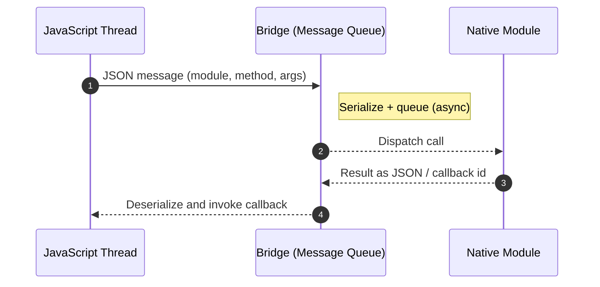
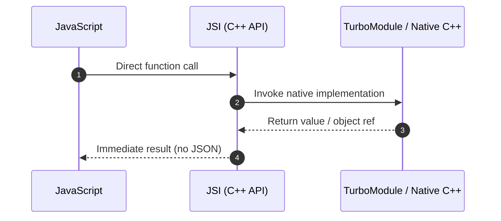

# Chapter 1: Introduction - The "Why"

The React Native New Architecture is arguably the most significant evolution in the framework's history. While it became the default in the React Native 0.76 release in October 2024[^2], its story begins much earlier. The vision was first shared with the community in a 2018 presentation at React Conf[^1]. This marked the beginning of a multi-year effort to fundamentally re-imagine the communication layer between JavaScript and the native host platform.

**Important Update (2025):** As of React Native 0.76, the New Architecture is enabled by default for all new projects. This means that developers no longer need to opt-in to the New Architecture - it's the standard experience. However, if you encounter issues or need to maintain compatibility with legacy libraries, you can still opt-out using the procedures outlined in Chapter 7.

**Future Plans:** The React Native team has indicated plans to remove the legacy Bridge architecture in future versions. The C++ headers under `packages/react-native/ReactCommon/cxxreact/` carry an explicit `[[deprecated("This API will be removed along with the legacy architecture.")]]` attribute on roughly twenty classes (e.g. `JSExecutor`, `Instance`, `ModuleRegistry`, `NativeToJsBridge`, `CxxNativeModule`, `JSIExecutor`, `JSINativeModules`)[^3]. The Obj-C side carries the same intent with slightly different wording. `RCTAppDelegate`, `RCTReactNativeFactory`, and `RCTArchConfiguratorProtocol` are marked as "removed when removing the legacy architecture"[^3a]. While opt-out remains supported in current versions, developers should plan for eventual migration to the New Architecture.

This was not a minor refactoring but a deep, foundational change designed to address systemic performance bottlenecks and unlock new capabilities for the framework. To fully appreciate the new architecture, one must first understand the limitations of the system it replaced: the original architecture, centered around a component known as "the Bridge."

## Visual Overview: Old vs New





## The Old Architecture: A Story of the Bridge

In the original architecture, the entire communication system between the JavaScript thread (where the application's business logic runs) and the Native thread (where the host platform's UI and services run) was funneled through a single, asynchronous message queue: **the Bridge**.

### Understanding the Bridge Architecture

To truly understand the limitations, let's examine how the Bridge worked in practice. Imagine a simple scenario where a React Native app needs to get the device's current location:

```javascript
// JavaScript side (pre-0.60 RN; navigator.geolocation was removed from core
// in April 2019 and now lives in @react-native-community/geolocation[^geo]).
navigator.geolocation.getCurrentPosition(
  (position) => {
    console.log('Location:', position.coords);
  },
  (error) => {
    console.error('Error:', error);
  }
);
```

Here's what happened behind the scenes in the old architecture (note that the shapes below are a conceptual sketch, see the next paragraph for the actual wire format):

1. JavaScript would create a call like `{"module": "LocationObserver", "method": "getCurrentPosition", "args": [], "callbackIDs": [23, 24]}`
2. The call would be serialized into JSON and added to the Bridge queue
3. The native side would eventually process this message (timing unpredictable)
4. Native code would fetch the location (which might take seconds)
5. The result would be serialized: `{"coords": {"latitude": 37.7749, "longitude": -122.4194}, ...}`
6. This JSON would be sent back through the Bridge
7. JavaScript would deserialize and invoke the callback

In the actual implementation, `MessageQueue.js` does not send name-keyed JSON objects. It enqueues integer `moduleID` / `methodID` pairs into three parallel arrays (`MODULE_IDS`, `METHOD_IDS`, `PARAMS`) and flushes them as a tuple `[[moduleIDs], [methodIDs], [params], callID]`. Callback ids are encoded into the params array by bit-shifting `_callID` (failure: `callID << 1`; success: `(callID << 1) | 1`)[^bridge-wire]. The point of the conceptual JSON shape above is the round-trip: every call serializes, crosses an async queue, and gets re-parsed on the other side. The new architecture removes that.

This design, while functional, had several inherent limitations that became more pronounced as React Native applications grew in complexity:

### 1. Asynchronous Communication: The Latency Problem

Every call from JavaScript to a native module was, by necessity, asynchronous. This created several challenging scenarios:

**Example: Synchronous Storage Access**
```javascript
// What developers wanted (but couldn't have):
const token = Storage.getItem('authToken'); // ❌ Not possible
if (token) {
  api.authenticate(token);
}

// What they had to do instead:
Storage.getItem('authToken', (error, token) => { // ✅ Forced async
  if (token) {
    api.authenticate(token);
  }
});
```

This forced asynchronicity made certain patterns impossible:
- Synchronous getters for UI properties
- Immediate validation of native state
- Real-time audio/video processing
- High-frequency sensor data reading

### 2. Serialization Overhead: The Performance Killer

All data sent across the Bridge had to be serialized into JSON strings. Let's examine the actual cost:

**Example: Sending an Image Buffer**
```javascript
// Attempting to send a 1MB image buffer
const imageData = new Uint8Array(1048576); // 1MB of pixel data

// Old Architecture: This would require:
// 1. Convert Uint8Array to regular array (expensive!)
// 2. JSON.stringify the array (very expensive!)
// 3. Send the resulting ~3MB JSON string across the Bridge
// 4. Parse the JSON on native side (expensive!)
// 5. Convert back to native data structure

// Rough overhead (illustrative, not measured): ~3-5x the original data size
// after JSON encoding, plus parse cost on the receiving side. Wall-clock
// figures for a 1MB buffer vary widely by device and aren't quoted in the
// official docs; the reactnative.dev landing page only describes the
// qualitative cost ("removes the asynchronous bridge... and replaces it
// with JSI", "no serialization costs")[^2].
```

The serialization overhead was particularly devastating for:
- **Large Data Sets**: Sending arrays of complex objects
- **Binary Data**: Images, audio buffers, video frames
- **Frequent Updates**: Animation values, gesture tracking
- **Complex Objects**: Nested structures with circular references

### 3. Congestion and Bottlenecks: The Single Lane Highway

The Bridge acted as a single lane of traffic. Here's a real-world scenario that would cause severe performance issues:

**Example: Gesture-Driven Animation**
```javascript
// Old Architecture: Each gesture update goes through the Bridge
const panResponder = PanResponder.create({
  onPanResponderMove: (event, gestureState) => {
    // This fires 60+ times per second during a pan gesture
    // Each update must be serialized and sent through the Bridge
    Animated.event([
      null,
      { dx: this.pan.x, dy: this.pan.y }
    ])(event, gestureState);
  }
});
```

During a single swipe gesture lasting one second:
- 60+ messages queued on the Bridge
- Each message ~200 bytes when serialized
- Total data: ~12KB just for one gesture
- Result: 16-33ms latency per frame (missing 60fps target)

### The Compound Effect

These limitations compounded in real applications. Consider a social media feed with videos:

```javascript
// Old Architecture nightmare scenario
const VideoFeed = () => {
  const [videos, setVideos] = useState([]);
  
  // Problem 1: Large data serialization
  useEffect(() => {
    fetchVideos().then(data => {
      // Serializing array of video metadata (potentially MBs)
      setVideos(data);
    });
  }, []);
  
  // Problem 2: High-frequency updates
  const onScroll = (event) => {
    // Fires continuously during scroll
    videos.forEach((video, index) => {
      // Each visibility check goes through the Bridge
      checkVideoVisibility(video.id, event.contentOffset);
    });
  };
  
  // Problem 3: Async coordination
  const playVideo = async (videoId) => {
    // Multiple async Bridge calls needed
    await VideoModule.load(videoId);
    await VideoModule.prepare();
    await VideoModule.play();
    // Total latency: 50-150ms before video starts
  };
};
```

The result was a poor user experience:
- Janky scrolling due to Bridge congestion
- Delayed video playback
- Dropped frames during animations
- High memory usage from serialization overhead

## The Vision: A New Foundation for React Native

The vision for the New Architecture was to tear down these limitations and create a more performant, tightly integrated, and capable framework. The core goals, as articulated by the React Native team and community collaborators, were:

### 1. Performance: Direct Communication Without Serialization

The new architecture enables direct, synchronous communication between JavaScript and native platforms. Here's what this means in practice (the `DeviceInfo` methods below are illustrative shapes; battery APIs aren't in core React Native, they live in community modules like `react-native-device-info`):

**Before (Bridge Architecture):**
```javascript
// Getting device info required async callbacks.
DeviceInfo.getBatteryLevel((level) => {
  if (level < 0.2) {
    // This warning appears 50-100ms later.
    showLowBatteryWarning();
  }
});
```

**After (New Architecture):**
```javascript
// Direct synchronous access from a TurboModule spec method.
const batteryLevel = DeviceInfo.getBatteryLevelSync();
if (batteryLevel < 0.2) {
  // Immediate response.
  showLowBatteryWarning();
}
```

The performance improvements vary by workload. Order-of-magnitude figures often quoted for the new architecture (illustrative, not from an official Meta benchmark):
- **Method Calls**: synchronous sub-millisecond TurboModule calls vs. async-queued Bridge calls (often 10-100x faster end-to-end for what used to be a callback round-trip).
- **Data Transfer**: skipping JSON encode/decode is a 5-20x win for large payloads, and the win scales with payload size.
- **Memory Usage**: removing the serialized copy roughly halves working-set memory on sustained-large-payload paths.

For actual measured numbers, see the React Native team's renderer-performance write-up linked from the architecture landing page[^2].

### 2. Type Safety: Compile-Time Contract Enforcement

The new architecture introduces strict type safety across the JavaScript-Native boundary:

**Before (Runtime Errors):**

JavaScript call site:
```javascript
NativeModules.MyModule.processUser({
  name: "John",
  age: "25", // ❌ Wrong type - will crash at runtime
});
```

Native (iOS) handler with the old `RCT_EXPORT_METHOD` macro from `RCTBridgeModule.h`[^rct-export]:
```objc
RCT_EXPORT_METHOD(processUser:(NSDictionary *)user) {
  NSNumber *age = user[@"age"]; // Crash: NSString cannot be cast to NSNumber.
}
```

**After (Compile-Time Safety):**

TypeScript spec (the codegen reads this to emit the native interface)[^tm-spec]:
```typescript
import type {TurboModule} from 'react-native';
import {TurboModuleRegistry} from 'react-native';

export interface Spec extends TurboModule {
  processUser(user: { name: string; age: number }): void;
}

export default TurboModuleRegistry.getEnforcing<Spec>('MyModule');
```

Generated Obj-C++ interface (the actual codegen output shape is in `packages/react-native-codegen/src/generators/modules/__tests__/__snapshots__/GenerateModuleHObjCpp-test.js.snap`)[^tm-codegen]:
```objc
- (void)processUser:(JS::NativeMyModule::SpecProcessUserUser &)user {
  // Type-safe access with compile-time checking. Note: in Obj-C++ codegen,
  // string fields are NSString *, not std::string. The std::string return
  // shape is what the C++-only ("Cxx") TurboModule codegen emits.
  NSString *name = user.name();
  double age = user.age(); // Guaranteed to be a JS number → double.
}
```

### 3. Concurrent Rendering: Modern React Features

The new architecture supports React 18's concurrent features and, at the current React Native HEAD, the React 19 peer dependency (`"react": "^19.2.3"` in `packages/react-native/package.json`)[^react-pin]:

**Automatic Batching Example:**
```javascript
// Old Architecture: Multiple renders.
function handleClickOld() {
  setCount(c => c + 1); // Render 1
  setFlag(f => !f);     // Render 2
  setValue(v => v * 2); // Render 3
}

// New Architecture: Single render with automatic batching.
function handleClickNew() {
  setCount(c => c + 1); // }
  setFlag(f => !f);     // } All batched into one render
  setValue(v => v * 2); // }
}
```

**Transitions for Non-Urgent Updates:**
```javascript
function SearchResults() {
  const [query, setQuery] = useState('');
  const [results, setResults] = useState([]);
  const [isPending, startTransition] = useTransition();

  function handleSearch(input) {
    setQuery(input); // Urgent: update input immediately
    
    startTransition(() => {
      // Non-urgent: can be interrupted for user input
      const filtered = searchDatabase(input);
      setResults(filtered);
    });
  }

  return (
    <>
      <SearchInput value={query} onChange={handleSearch} />
      {isPending && <Spinner />}
      <ResultsList results={results} />
    </>
  );
}
```

### 4. Improved Interoperability: Seamless Native Integration

The new architecture makes it trivial to expose complex native objects to JavaScript:

**Real-World Example: Native Database Access**
```cpp
// C++ Implementation
class DatabaseHostObject : public jsi::HostObject {
public:
  jsi::Value get(jsi::Runtime& rt, const jsi::PropNameID& name) override {
    if (name.utf8(rt) == "query") {
      return jsi::Function::createFromHostFunction(rt, 
        jsi::PropNameID::forAscii(rt, "query"), 1,
        [this](jsi::Runtime& rt, const jsi::Value& thisVal, 
               const jsi::Value* args, size_t count) -> jsi::Value {
          // Direct SQL execution without serialization
          std::string sql = args[0].getString(rt).utf8(rt);
          auto results = database_.executeQuery(sql);
          
          // Return results directly - no JSON conversion
          return convertResultsToJSI(rt, results);
        });
    }
    return jsi::Value::undefined();
  }
  
private:
  SQLiteDatabase database_;
};
```

**JavaScript Usage:**
```javascript
// Direct access to native database
const results = db.query("SELECT * FROM users WHERE active = 1");
// Results are immediately available, no serialization needed
console.log(`Found ${results.length} active users`);
```

### 5. React 18 and Beyond: Future-Proof Architecture

The new architecture enables cutting-edge React features. Note that `use(promise)` was experimental/canary in React 18 and became stable in React 19. Since React Native main now pins React 19.2+, the example below works out of the box[^react-pin]:

**Suspense for Data Fetching:**
```javascript
function UserProfile({ userId }) {
  // This suspends until user data is ready.
  const user = use(fetchUser(userId));

  return (
    <View>
      <Text>{user.name}</Text>
      <Image source={{ uri: user.avatar }} />
    </View>
  );
}

function App() {
  return (
    <Suspense fallback={<LoadingSpinner />}>
      <UserProfile userId={123} />
    </Suspense>
  );
}
```

**Server Components (Future):**
```javascript
// This could run on the server in the future
async function ServerUserList() {
  const users = await db.query("SELECT * FROM users");
  
  return (
    <View>
      {users.map(user => (
        <UserCard key={user.id} user={user} />
      ))}
    </View>
  );
}
```

## The Three Pillars of the New Architecture

To achieve this vision, the team built the new architecture on three core pillars, which the subsequent chapters of this report will explore in detail:

### The JavaScript Interface (JSI)
The new foundational layer that replaces the Bridge, allowing for direct, synchronous method calls between the two realms. JSI is a lightweight C++ API (header at `packages/react-native/ReactCommon/jsi/jsi/jsi.h`, around 2,200 lines)[^jsi-header] that:
- Lets JavaScript hold direct references to C++ objects, and vice versa, via primitives like `HostObject`, `HostFunction`, and `NativeState`. The reactnative.dev landing page describes this as "an interface that allows JavaScript to hold a reference to a C++ object and vice-versa"[^2]. This avoids the serialization round-trip; it does not literally share heap memory between the JS engine and native code.
- Offers zero-copy paths for binary buffers (`ArrayBuffer::data()` returns a raw pointer to engine-managed bytes) and for host objects (a C++ object directly addressable from JS). Other accessors like `String::utf8(rt)` still copy.
- Is itself synchronous (a `HostFunction` returns a `Value`); asynchronous work happens by returning a JS `Promise` or by hopping threads via `CallInvoker`.
- Is engine-agnostic by design: `jsi.h` has no engine-specific includes, only standard headers. In-tree React Native ships JSI bindings for Hermes (`ReactCommon/hermes/executor/HermesExecutorFactory.{h,cpp}`) and JavaScriptCore (`ReactCommon/jsc/JSCRuntime.{h,cpp}`); V8 support exists as a separate community project, `react-native-v8`.

### Fabric: The New Rendering System
The modern UI renderer that uses JSI to create a more responsive and efficient UI layer. Fabric:
- Performs layout calculations in C++ for cross-platform consistency (`ReactCommon/yoga/` is the C++ Yoga implementation, and `ReactCommon/react/renderer/components/` holds the Fabric component descriptors).
- Exposes synchronous layout measurements via the C++ `UIManager`. `LayoutMetrics UIManager::getRelativeLayoutMetrics(...) const` is the accessor at `ReactCommon/react/renderer/uimanager/UIManager.h`[^fabric-measure].
- Supports React 18 and React 19's concurrent renderer.
- Provides tighter integration with native gesture systems via the synchronous mount path.

### TurboModules: Next-Gen Native Modules
The evolution of native modules, built on JSI, which are loaded on-demand and can be invoked synchronously from JavaScript. TurboModules:
- Load lazily. `TurboModuleRegistry.get(name)` and `getEnforcing(name)` route through `global.__turboModuleProxy(name)` (defined in `packages/react-native/Libraries/TurboModule/TurboModuleRegistry.js`), which resolves a module the first time JS asks for it[^tm-registry].
- Support synchronous method calls when the spec declares a synchronous return type; methods declared as returning `Promise<T>` stay asynchronous.
- Provide compile-time type safety on both sides of the boundary, generated by codegen from a TS or Flow spec.
- Improve JS-side dead-code elimination: each module is imported by name from its own spec file, so an unused spec drops out of the bundle. The native binary still contains whatever modules are registered.

---

**Citations:**

[^1]: Parashuram N, "React Native's New Architecture" (React Conf 2018). YouTube video id `UcqRXTriUVI`. [https://www.youtube.com/watch?v=UcqRXTriUVI](https://www.youtube.com/watch?v=UcqRXTriUVI)
[^2]: "About the New Architecture". React Native Documentation. [https://reactnative.dev/architecture/landing-page](https://reactnative.dev/architecture/landing-page)
[^3]: C++ deprecation attributes that quote the phrase verbatim, in `packages/react-native/ReactCommon/cxxreact/`: `JSExecutor.h:34,48,56`, `Instance.h:37,44`, `NativeToJsBridge.h:41`, `ModuleRegistry.h:28,33`, `MethodCall.h:20,33`, `JSIndexedRAMBundle.h:26`, `CxxNativeModule.h:26,29`, `JSModulesUnbundle.h:18`, `RAMBundleRegistry.h:26`, `NativeModule.h:19,31`, plus `packages/react-native/ReactCommon/jsiexecutor/jsireact/JSIExecutor.h:71` and `JSINativeModules.h:24`. Run `rg "removed along with the legacy" packages/react-native/` to enumerate. [https://github.com/facebook/react-native](https://github.com/facebook/react-native)
[^3a]: Obj-C variant in `packages/react-native/Libraries/AppDelegate/`: `RCTAppDelegate.h:62-73`, `RCTReactNativeFactory.h:64,82,113-115`, `RCTArchConfiguratorProtocol.h:13-14,20-35`. These use the wording "removed when removing the legacy architecture" or "removed when we remove the legacy architecture."
[^geo]: `navigator.geolocation` was removed from React Native core in three commits in April 2019: `45bd2b514b5` ("Remove navigator.geolocation, use Geolocation", 2019-04-01), `9834c580af6` ("Move Geolocation JS code to FB internal", 2019-04-01), and `17dbf988845` ("Move iOS Geolocation code out from the repo", 2019-04-02). Recommended replacement: [`@react-native-community/geolocation`](https://github.com/michalchudziak/react-native-geolocation).
[^bridge-wire]: `packages/react-native/Libraries/BatchedBridge/MessageQueue.js`, lines 33-35 (the `MODULE_IDS=0; METHOD_IDS=1; PARAMS=2;` constants), 140 and 324 (`this._queue = [[], [], [], this._callID]`), 253-254 (`this._queue[MODULE_IDS].push(moduleID); this._queue[METHOD_IDS].push(methodID);`), 227-231 (callback id encoding via `_callID << 1`).
[^rct-export]: `packages/react-native/React/Base/RCTBridgeModule.h:218` defines `#define RCT_EXPORT_METHOD(method) RCT_REMAP_METHOD(, method)`. The macro is annotated with `RCT_DEPRECATED` on the surrounding `methodQueue` property and is part of the legacy-arch surface scheduled for removal.
[^tm-spec]: `packages/react-native/Libraries/TurboModule/RCTExport.d.ts:10-12` defines `export interface TurboModule { getConstants?(): {}; }`. A representative spec is `packages/react-native/src/private/specs_DEPRECATED/modules/NativeSampleTurboModule.js:33` (`export interface Spec extends TurboModule { ... }`).
[^tm-codegen]: Codegen snapshot at `packages/react-native-codegen/src/generators/modules/__tests__/__snapshots__/GenerateModuleHObjCpp-test.js.snap`, lines 855-862 (`NSString *name() const; ... double id_() const;`) and 978 (`inline NSString *JS::NativeExceptionsManager::ExceptionData::name() const`). String fields in Obj-C++ codegen are `NSString *`, never `std::string`. The C++-only ("Cxx") variant emits `std::string` instead; see `GenerateModuleH-test.js.snap`.
[^react-pin]: `packages/react-native/package.json:151-153`: `"peerDependencies": { ..., "react": "^19.2.3" }`. The bundled reconciler in this build line targets React 19.
[^tm-registry]: `packages/react-native/Libraries/TurboModule/TurboModuleRegistry.js:17-46`. `turboModuleProxy = global.__turboModuleProxy`, then `requireModule<T>(name)` calls `turboModuleProxy(name)` on demand.
[^jsi-header]: `packages/react-native/ReactCommon/jsi/jsi/jsi.h`. As of v0.86 main HEAD it's 2,266 lines and includes only the C++ standard library. Engine bindings live in sibling directories (`hermes/`, `jsc/`).
[^fabric-measure]: `packages/react-native/ReactCommon/react/renderer/uimanager/UIManager.h:183-186`: `LayoutMetrics getRelativeLayoutMetrics(const ShadowNode &shadowNode, const ShadowNode *ancestorShadowNode, LayoutableShadowNode::LayoutInspectingPolicy policy) const;`.
