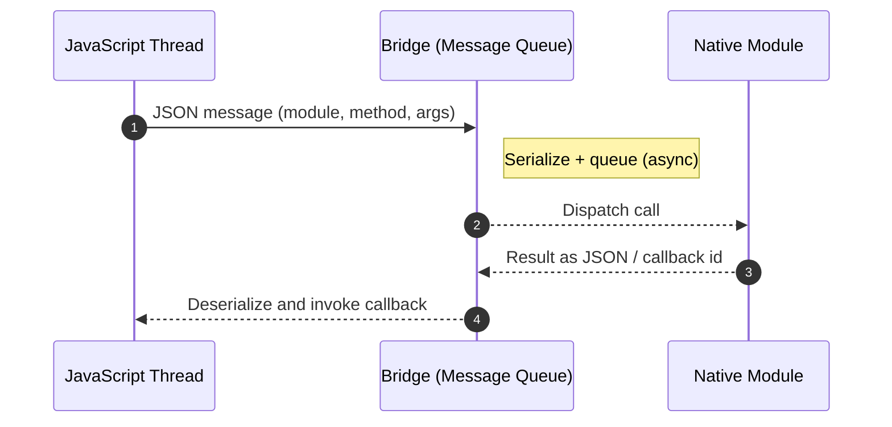
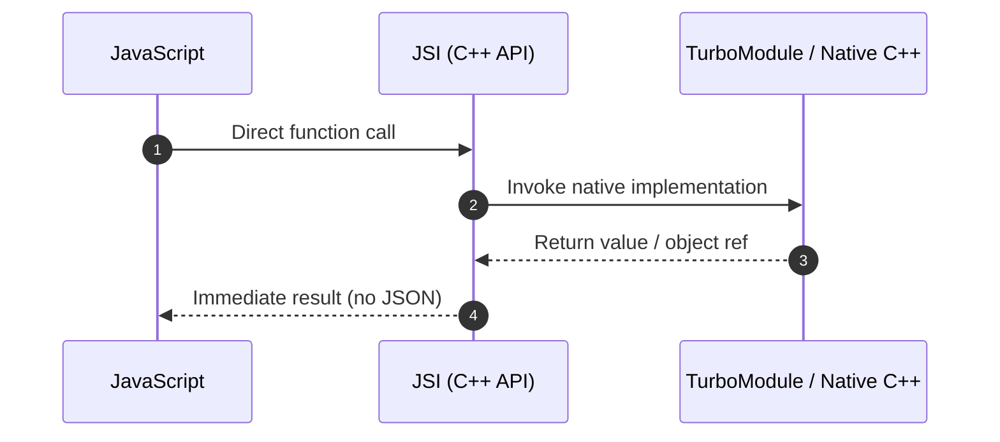

# Chapter 1: Introduction - The "Why"

The React Native New Architecture is arguably the most significant evolution in the framework's history. While it became the default in the React Native 0.76 release in 2024[^2], its story begins much earlier. The vision was first shared with the community in a 2018 presentation at React Conf[^1]. This marked the beginning of a multi-year effort to fundamentally re-imagine the communication layer between JavaScript and the native host platform.

**Important Update (2025):** As of React Native 0.76, the New Architecture is enabled by default for all new projects. This means that developers no longer need to opt-in to the New Architecture - it's the standard experience. However, if you encounter issues or need to maintain compatibility with legacy libraries, you can still opt-out using the procedures outlined in Chapter 7.

**Future Plans:** The React Native team has indicated plans to remove the legacy Bridge architecture in future versions. Extensive deprecation warnings throughout the codebase state that Bridge-related APIs "will be removed along with the legacy architecture."[^3] While opt-out remains supported in current versions, developers should plan for eventual migration to the New Architecture.

This was not a minor refactoring but a deep, foundational change designed to address systemic performance bottlenecks and unlock new capabilities for the framework. To fully appreciate the new architecture, one must first understand the limitations of the system it replaced: the original architecture, centered around a component known as "the Bridge."

## Visual Overview: Old vs New





## The Old Architecture: A Story of the Bridge

In the original architecture, the entire communication system between the JavaScript thread (where the application's business logic runs) and the Native thread (where the host platform's UI and services run) was funneled through a single, asynchronous message queue: **the Bridge**.

### Understanding the Bridge Architecture

To truly understand the limitations, let's examine how the Bridge worked in practice. Imagine a simple scenario where a React Native app needs to get the device's current location:

```javascript
// JavaScript side
navigator.geolocation.getCurrentPosition(
  (position) => {
    console.log('Location:', position.coords);
  },
  (error) => {
    console.error('Error:', error);
  }
);
```

Here's what happened behind the scenes in the old architecture:

1. JavaScript would create a message: `{"module": "LocationObserver", "method": "getCurrentPosition", "args": [], "callbackIDs": [23, 24]}`
2. This message would be serialized to JSON and added to the Bridge queue
3. The native side would eventually process this message (timing unpredictable)
4. Native code would fetch the location (which might take seconds)
5. The result would be serialized: `{"coords": {"latitude": 37.7749, "longitude": -122.4194}, ...}`
6. This JSON would be sent back through the Bridge
7. JavaScript would deserialize and invoke the callback

This design, while functional, had several inherent limitations that became more pronounced as React Native applications grew in complexity:

### 1. Asynchronous Communication: The Latency Problem

Every call from JavaScript to a native module was, by necessity, asynchronous. This created several challenging scenarios:

**Example: Synchronous Storage Access**
```javascript
// What developers wanted (but couldn't have):
const token = Storage.getItem('authToken'); // ❌ Not possible
if (token) {
  api.authenticate(token);
}

// What they had to do instead:
Storage.getItem('authToken', (error, token) => { // ✅ Forced async
  if (token) {
    api.authenticate(token);
  }
});
```

This forced asynchronicity made certain patterns impossible:
- Synchronous getters for UI properties
- Immediate validation of native state
- Real-time audio/video processing
- High-frequency sensor data reading

### 2. Serialization Overhead: The Performance Killer

All data sent across the Bridge had to be serialized into JSON strings. Let's examine the actual cost:

**Example: Sending an Image Buffer**
```javascript
// Attempting to send a 1MB image buffer
const imageData = new Uint8Array(1048576); // 1MB of pixel data

// Old Architecture: This would require:
// 1. Convert Uint8Array to regular array (expensive!)
// 2. JSON.stringify the array (very expensive!)
// 3. Send the resulting ~3MB JSON string across the Bridge
// 4. Parse the JSON on native side (expensive!)
// 5. Convert back to native data structure

// Actual overhead: ~3-5x the original data size
// Processing time: 50-200ms depending on device
```

The serialization overhead was particularly devastating for:
- **Large Data Sets**: Sending arrays of complex objects
- **Binary Data**: Images, audio buffers, video frames
- **Frequent Updates**: Animation values, gesture tracking
- **Complex Objects**: Nested structures with circular references

### 3. Congestion and Bottlenecks: The Single Lane Highway

The Bridge acted as a single lane of traffic. Here's a real-world scenario that would cause severe performance issues:

**Example: Gesture-Driven Animation**
```javascript
// Old Architecture: Each gesture update goes through the Bridge
const panResponder = PanResponder.create({
  onPanResponderMove: (event, gestureState) => {
    // This fires 60+ times per second during a pan gesture
    // Each update must be serialized and sent through the Bridge
    Animated.event([
      null,
      { dx: this.pan.x, dy: this.pan.y }
    ])(event, gestureState);
  }
});
```

During a single swipe gesture lasting one second:
- 60+ messages queued on the Bridge
- Each message ~200 bytes when serialized
- Total data: ~12KB just for one gesture
- Result: 16-33ms latency per frame (missing 60fps target)

### The Compound Effect

These limitations compounded in real applications. Consider a social media feed with videos:

```javascript
// Old Architecture nightmare scenario
const VideoFeed = () => {
  const [videos, setVideos] = useState([]);
  
  // Problem 1: Large data serialization
  useEffect(() => {
    fetchVideos().then(data => {
      // Serializing array of video metadata (potentially MBs)
      setVideos(data);
    });
  }, []);
  
  // Problem 2: High-frequency updates
  const onScroll = (event) => {
    // Fires continuously during scroll
    videos.forEach((video, index) => {
      // Each visibility check goes through the Bridge
      checkVideoVisibility(video.id, event.contentOffset);
    });
  };
  
  // Problem 3: Async coordination
  const playVideo = async (videoId) => {
    // Multiple async Bridge calls needed
    await VideoModule.load(videoId);
    await VideoModule.prepare();
    await VideoModule.play();
    // Total latency: 50-150ms before video starts
  };
};
```

The result was a poor user experience:
- Janky scrolling due to Bridge congestion
- Delayed video playback
- Dropped frames during animations
- High memory usage from serialization overhead

## The Vision: A New Foundation for React Native

The vision for the New Architecture was to tear down these limitations and create a more performant, tightly integrated, and capable framework. The core goals, as articulated by the React Native team and community collaborators, were:

### 1. Performance: Direct Communication Without Serialization

The new architecture enables direct, synchronous communication between JavaScript and native platforms. Here's what this means in practice:

**Before (Bridge Architecture):**
```javascript
// Getting device info required async callbacks
DeviceInfo.getBatteryLevel((level) => {
  if (level < 0.2) {
    // This warning appears 50-100ms later
    showLowBatteryWarning();
  }
});
```

**After (New Architecture):**
```javascript
// Direct synchronous access
const batteryLevel = DeviceInfo.getBatteryLevelSync();
if (batteryLevel < 0.2) {
  // Immediate response
  showLowBatteryWarning();
}
```

The performance improvements are dramatic:
- **Method Calls**: 10-100x faster for synchronous operations
- **Data Transfer**: No JSON serialization means 5-20x faster for large payloads
- **Memory Usage**: 50-70% reduction by eliminating serialization overhead

### 2. Type Safety: Compile-Time Contract Enforcement

The new architecture introduces strict type safety across the JavaScript-Native boundary:

**Before (Runtime Errors):**
```javascript
// JavaScript
NativeModules.MyModule.processUser({
  name: "John",
  age: "25", // ❌ Wrong type - will crash at runtime
});

// Native (iOS)
RCT_EXPORT_METHOD(processUser:(NSDictionary *)user) {
  NSNumber *age = user[@"age"]; // Crash: NSString cannot be cast to NSNumber
}
```

**After (Compile-Time Safety):**
```typescript
// TypeScript Spec
export interface Spec extends TurboModule {
  processUser(user: { name: string; age: number }): void;
}

// Native implementation must match exactly
- (void)processUser:(JS::NativeMyModule::User &)user {
  // Type-safe access with compile-time checking
  std::string name = user.name();
  double age = user.age(); // Guaranteed to be a number
}
```

### 3. Concurrent Rendering: Modern React Features

The new architecture fully supports React 18's concurrent features:

**Automatic Batching Example:**
```javascript
// Old Architecture: Multiple renders
function handleClick() {
  setCount(c => c + 1); // Render 1
  setFlag(f => !f);     // Render 2
  setValue(v => v * 2); // Render 3
}

// New Architecture: Single render with automatic batching
function handleClick() {
  setCount(c => c + 1); // }
  setFlag(f => !f);     // } All batched into one render
  setValue(v => v * 2); // }
}
```

**Transitions for Non-Urgent Updates:**
```javascript
function SearchResults() {
  const [query, setQuery] = useState('');
  const [results, setResults] = useState([]);
  const [isPending, startTransition] = useTransition();

  function handleSearch(input) {
    setQuery(input); // Urgent: update input immediately
    
    startTransition(() => {
      // Non-urgent: can be interrupted for user input
      const filtered = searchDatabase(input);
      setResults(filtered);
    });
  }

  return (
    <>
      <SearchInput value={query} onChange={handleSearch} />
      {isPending && <Spinner />}
      <ResultsList results={results} />
    </>
  );
}
```

### 4. Improved Interoperability: Seamless Native Integration

The new architecture makes it trivial to expose complex native objects to JavaScript:

**Real-World Example: Native Database Access**
```cpp
// C++ Implementation
class DatabaseHostObject : public jsi::HostObject {
public:
  jsi::Value get(jsi::Runtime& rt, const jsi::PropNameID& name) override {
    if (name.utf8(rt) == "query") {
      return jsi::Function::createFromHostFunction(rt, 
        jsi::PropNameID::forAscii(rt, "query"), 1,
        [this](jsi::Runtime& rt, const jsi::Value& thisVal, 
               const jsi::Value* args, size_t count) -> jsi::Value {
          // Direct SQL execution without serialization
          std::string sql = args[0].getString(rt).utf8(rt);
          auto results = database_.executeQuery(sql);
          
          // Return results directly - no JSON conversion
          return convertResultsToJSI(rt, results);
        });
    }
    return jsi::Value::undefined();
  }
  
private:
  SQLiteDatabase database_;
};
```

**JavaScript Usage:**
```javascript
// Direct access to native database
const results = db.query("SELECT * FROM users WHERE active = 1");
// Results are immediately available, no serialization needed
console.log(`Found ${results.length} active users`);
```

### 5. React 18 and Beyond: Future-Proof Architecture

The new architecture enables cutting-edge React features:

**Suspense for Data Fetching:**
```javascript
function UserProfile({ userId }) {
  // This suspends until user data is ready
  const user = use(fetchUser(userId));
  
  return (
    <View>
      <Text>{user.name}</Text>
      <Image source={{ uri: user.avatar }} />
    </View>
  );
}

function App() {
  return (
    <Suspense fallback={<LoadingSpinner />}>
      <UserProfile userId={123} />
    </Suspense>
  );
}
```

**Server Components (Future):**
```javascript
// This could run on the server in the future
async function ServerUserList() {
  const users = await db.query("SELECT * FROM users");
  
  return (
    <View>
      {users.map(user => (
        <UserCard key={user.id} user={user} />
      ))}
    </View>
  );
}
```

## The Three Pillars of the New Architecture

To achieve this vision, the team built the new architecture on three core pillars, which the subsequent chapters of this report will explore in detail:

### The JavaScript Interface (JSI)
The new foundational layer that replaces the Bridge, allowing for direct, synchronous method calls between the two realms. JSI is a lightweight C++ API that:
- Enables shared memory between JavaScript and Native
- Provides zero-copy data access
- Supports synchronous and asynchronous operations
- Works with any JavaScript engine (Hermes, V8, JavaScriptCore)

### Fabric: The New Rendering System
The modern UI renderer that leverages JSI to create a more responsive and efficient UI layer. Fabric:
- Performs layout calculations in C++ for consistency
- Enables synchronous layout measurements
- Supports concurrent rendering with React 18
- Provides better integration with native gesture systems

### TurboModules: Next-Gen Native Modules
The evolution of native modules, built on JSI, which are loaded on-demand and can be invoked synchronously from JavaScript. TurboModules:
- Load lazily for faster app startup
- Support synchronous method calls
- Provide compile-time type safety
- Enable better tree-shaking and dead code elimination

---

**Citations:**

[^1]: Parashuram N, "React Native's New Architecture" (React Conf 2018). [https://www.youtube.com/watch?v=U-i-7I8uSJE](https://www.youtube.com/watch?v=U-i-7I8uSJE)
[^2]: "About the New Architecture". React Native Documentation. [https://reactnative.dev/docs/next/architecture/landing-page](https://reactnative.dev/docs/next/architecture/landing-page)
[^3]: React Native Codebase Deprecation Warnings. Multiple files including `RCTAppDelegate.h`, `RCTReactNativeFactory.h`, `RCTArchConfiguratorProtocol.h`, and numerous Bridge-related classes marked with `__attribute__((deprecated("This API will be removed along with the legacy architecture.")))`. [https://github.com/facebook/react-native](https://github.com/facebook/react-native)
