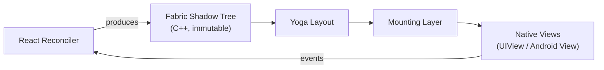

# Chapter 3: Fabric - The New Renderer

Fabric is the name of React Native's modern rendering system, a complete re-implementation of the UI manager that lies at the heart of the New Architecture. Built on top of the JSI, Fabric delivers a more performant, responsive, and interoperable UI layer. It replaces the legacy "UIManager" and fundamentally changes how React Native translates JavaScript component trees into native platform views.

**Current Status (2025):** Fabric is now the default renderer in React Native 0.76+. It powers all React Native applications and provides significant performance improvements, especially for complex UIs and animations. The legacy UIManager is deprecated and will be removed in future versions.

## The Motivation: From UIManager to Fabric

The legacy UIManager operated entirely across the asynchronous Bridge. Every UI update, from creating a view to changing its background color, required a serialized message to be sent from JavaScript to the native side. This architecture led to several problems:

-   **Latency:** The asynchronous nature meant there was no guarantee when a UI update would be processed, leading to dropped frames in complex animations or high-frequency updates.
-   **Layout Thrashing:** Layout was asynchronous. JavaScript could not synchronously read the resulting position or size of a view on screen, making certain UI patterns difficult and inefficient.
-   **Data Overhead:** All props and styles were serialized to JSON, adding significant overhead to every update.

Fabric was designed to solve these issues by creating a more tightly integrated and synchronous rendering pipeline, with a significant portion of the logic moved into a shared C++ core.

## Visual: Fabric Render Pipeline



## The C++ Core of Fabric

At its heart, Fabric introduces a new data structure that lives entirely in C++: the **Shadow Tree**. This tree is the single source of truth for the state of the UI.

### Understanding the Shadow Tree Architecture

The Shadow Tree is not just a simple mirror of the React component tree. It's a sophisticated, immutable data structure designed for concurrent updates and efficient diffing:

```cpp
// Simplified conceptual view of the Shadow Tree
ShadowTree (Root)
├── ScrollViewShadowNode
│   ├── ViewShadowNode (Header)
│   │   └── TextShadowNode ("Welcome")
│   └── ViewShadowNode (Content)
│       ├── ImageShadowNode
│       └── TextShadowNode ("Description")
└── ViewShadowNode (Footer)
```

### 1. `ShadowNode`: The Immutable Building Block

The fundamental unit of the Shadow Tree is the `ShadowNode`. As defined in `packages/react-native/ReactCommon/react/renderer/core/ShadowNode.h` [^1], it is the C++ representation of a React element.

```cpp
// Abridged from ShadowNode.h. See the full file for the complete API.
class ShadowNode : public Sealable,
                   public DebugStringConvertible,
                   public jsi::NativeState {
 public:
  // Constructors. Copy ctor and copy-assign are deleted: ShadowNode is
  // non-copyable. Updates go through `clone()`.
  ShadowNode(const ShadowNodeFragment &fragment,
             ShadowNodeFamily::Shared family,
             ShadowNodeTraits traits);
  ShadowNode(const ShadowNode &sourceShadowNode,
             const ShadowNodeFragment &fragment);

  // The canonical update API: returns a new node with the given fields
  // patched. Children/state/props that are not specified are carried over.
  std::shared_ptr<ShadowNode> clone(const ShadowNodeFragment &fragment) const;

 protected:
  Props::Shared props_;
  std::shared_ptr<const std::vector<std::shared_ptr<const ShadowNode>>> children_;
  State::Shared state_;
  int orderIndex_;

 private:
  ShadowNodeFamily::Shared family_;
  mutable std::atomic<bool> hasBeenMounted_{false};
};
```

Notes on the layout:

- `ShadowNode` inherits from `Sealable`. After commit, `sealRecursive()` is called so a node can no longer be mutated even by the C++ side (this is a no-op in release builds; the guard fires in debug).
- It inherits from `jsi::NativeState`, which is how a JS `ShadowNode` reference holds a C++ pointer.
- Layout metrics do not live on `ShadowNode`. They live on the `LayoutableShadowNode` subclass (`packages/react-native/ReactCommon/react/renderer/core/LayoutableShadowNode.h` [^5]). Any concrete view component descends through that branch.
- The `Shared` type alias pattern (`std::shared_ptr<const T>`) is defined on `RootShadowNode`, `Props`, `State`, `ShadowNodeFamily`, and other types in the renderer, but not on `ShadowNode` itself; pass `std::shared_ptr<const ShadowNode>` explicitly when you need it.

**Why Immutability Matters:**

In the legacy renderer, the JS thread and the UI thread could see the same view in inconsistent states because mutations happened across threads against a single set of native view objects. Fabric flips this: every "change" is the production of a new immutable node, and the old tree is still valid until the commit swap completes. Two threads that hold pointers to different revisions cannot trample each other.

Updates are produced by calling `clone()` on the source node with a `ShadowNodeFragment` carrying the changed fields. The actual machinery for changing a prop runs through the matching `ComponentDescriptor`'s `cloneProps`, since the descriptor knows how to parse a `RawProps` into the typed `Props` subclass for that component:

```cpp
// Excerpt: cloning one node with new props, as it actually happens inside
// UIManager::cloneNode (UIManager.cpp).
PropsParserContext propsParserContext{
    shadowNode.getFamily().getSurfaceId(), *contextContainer_};

auto &componentDescriptor = shadowNode.getComponentDescriptor();
auto props = componentDescriptor.cloneProps(
    propsParserContext,
    shadowNode.getProps(),
    std::move(rawProps));

auto clonedShadowNode = componentDescriptor.cloneShadowNode(
    shadowNode,
    {
        .props = props,
        .children = children,
        .runtimeShadowNodeReference = false,
    });
```

The originating `shadowNode` is unchanged. The clone shares structure with its parent's children vector until that too is cloned by the next ancestor up the path. This structural sharing is why a "single prop changed" mutation is cheap even on a thousand-node tree.

### Deep Dive: Props System

The Props system in Fabric is type-safe and per-component. The base `Props` class is small and stateless on its own; the real shape comes from the inheritance chain for each component.

```cpp
// Props.h (abridged). The base class is intentionally lean.
class Props : public virtual Sealable,
              public virtual DebugStringConvertible {
 public:
  using Shared = std::shared_ptr<const Props>;

  Props() = default;
  Props(const PropsParserContext &context,
        const Props &sourceProps,
        const RawProps &rawProps,
        const std::function<bool(const std::string &)> &filterObjectKeys = nullptr);

  // Called by the prop parser, once per property, while walking RawProps.
  // Subclasses override this and dispatch on `hash` to set their fields.
  void setProp(const PropsParserContext &context,
               RawPropsPropNameHash hash,
               const char *propName,
               const RawValue &value);

  std::string nativeId;
};
```

There is no `revision`, no `source`, no `rawProps` member on the base `Props`. Parsing happens through `RawPropsParser` walking the JS values and dispatching per-property hashes to the matching `setProp` overload. This is how Fabric avoids the per-update JSON allocations that the legacy renderer paid.

`ViewProps` is a `using` alias for `HostPlatformViewProps`, which on most platforms aliases `BaseViewProps`. The inheritance graph is `BaseViewProps : public YogaStylableProps, public AccessibilityProps`, and `YogaStylableProps` is what eventually inherits from `Props`. The flattened field set on `BaseViewProps` looks like this:

```cpp
// BaseViewProps.h (abridged). See the full file for the complete list.
class BaseViewProps : public YogaStylableProps, public AccessibilityProps {
 public:
  BaseViewProps() = default;
  BaseViewProps(
      const PropsParserContext &context,
      const BaseViewProps &sourceProps,
      const RawProps &rawProps,
      const std::function<bool(const std::string &)> &filterObjectKeys = nullptr);

  Float opacity{1.0};
  SharedColor backgroundColor{};  // wrapper around Color; pointer-like
  CascadedBorderRadii borderRadii{};
  CascadedBorderColors borderColors{};
  Transform transform{};
  TransformOrigin transformOrigin{};
  BackfaceVisibility backfaceVisibility{};
  bool shouldRasterize{};
  std::optional<int> zIndex{};
  PointerEventsMode pointerEvents{};
  // ...and many more
};
```

`backgroundColor` is a `SharedColor` (a thin wrapper that hides the platform color representation), not a bare `Color`, which is why iOS code converts it via `RCTUIColorFromSharedColor(...)` and Android extracts a 32-bit int.

### State Management in Fabric

Unlike props, state can be updated from both JavaScript and native. The pattern is one `State` template parameterised by a per-component `StateData` POD. For `ScrollView` the data type is `ScrollViewState`:

```cpp
// ScrollViewState.h (abridged)
class ScrollViewState final {
 public:
  ScrollViewState(Point contentOffset,
                  Rect contentBoundingRect,
                  int scrollAwayPaddingTop);
  ScrollViewState() = default;

  Point contentOffset;
  Rect contentBoundingRect;
  int scrollAwayPaddingTop{0};
  bool disableViewCulling{false};

  Size getContentSize() const;
};
```

The content size is derived from `contentBoundingRect`, not stored directly. State writes go through `State::updateState(stateData)`, which schedules a commit on the shadow tree. The platform code that runs scrolling calls into this on each frame to keep the JS-visible content offset in sync, without making a JS roundtrip per scroll tick.

### 2. `ComponentDescriptor`: The Shadow Node Factory

Defined in `packages/react-native/ReactCommon/react/renderer/core/ComponentDescriptor.h` [^2], a `ComponentDescriptor` is a factory object responsible for creating and managing `ShadowNode` instances of a specific type.

```cpp
// ComponentDescriptor.h (abridged). Pure-virtual methods only.
class ComponentDescriptor {
 public:
  using Shared = std::shared_ptr<const ComponentDescriptor>;
  using Unique = std::unique_ptr<const ComponentDescriptor>;

  virtual ComponentHandle getComponentHandle() const = 0;
  virtual ComponentName getComponentName() const = 0;
  virtual ShadowNodeTraits getTraits() const = 0;

  virtual std::shared_ptr<ShadowNode> createShadowNode(
      const ShadowNodeFragment &fragment,
      const ShadowNodeFamily::Shared &family) const = 0;

  virtual std::shared_ptr<ShadowNode> cloneShadowNode(
      const ShadowNode &sourceShadowNode,
      const ShadowNodeFragment &fragment) const = 0;

  virtual void appendChild(
      const std::shared_ptr<const ShadowNode> &parentShadowNode,
      const std::shared_ptr<const ShadowNode> &childShadowNode) const = 0;

  // Note: cloneProps takes three arguments. The PropsParserContext is required.
  // RawProps is taken by value because it gets moved through the parser.
  virtual Props::Shared cloneProps(
      const PropsParserContext &context,
      const Props::Shared &props,
      RawProps rawProps) const = 0;

  virtual State::Shared createInitialState(
      const Props::Shared &props,
      const ShadowNodeFamily::Shared &family) const = 0;
  virtual State::Shared createState(
      const ShadowNodeFamily &family,
      const StateData::Shared &data) const = 0;

  virtual ShadowNodeFamily::Shared createFamily(
      const ShadowNodeFamilyFragment &fragment) const = 0;
};
```

There is no `createEventEmitter` on `ComponentDescriptor`. Event emitters are produced inside `ShadowNodeFamily::createEventEmitter()` (via the family that the descriptor returns from `createFamily(...)`) and passed through `ShadowNodeFragment`. The chapter-1 mental model of "descriptor builds emitter" is close, but the real factory method lives on the family, not the descriptor.

**Real Implementation - ViewComponentDescriptor:**

`ViewComponentDescriptor` is intentionally empty: it just plugs `ViewShadowNode` into the generic `ConcreteComponentDescriptor` template, which provides all the virtual overrides.

```cpp
// packages/react-native/ReactCommon/react/renderer/components/view/ViewComponentDescriptor.h
class ViewComponentDescriptor
    : public ConcreteComponentDescriptor<ViewShadowNode> {
 public:
  ViewComponentDescriptor(const ComponentDescriptorParameters &parameters)
      : ConcreteComponentDescriptor<ViewShadowNode>(parameters) {}
};
```

The actual factory work is in `ConcreteComponentDescriptor<T>` [^6]:

```cpp
// ConcreteComponentDescriptor.h (abridged)
template <typename ShadowNodeT>
class ConcreteComponentDescriptor : public ComponentDescriptor {
 public:
  ComponentHandle getComponentHandle() const override {
    return ShadowNodeT::Handle();
  }
  ComponentName getComponentName() const override {
    return ShadowNodeT::Name();  // for View: the string "View", not "RCTView"
  }

  std::shared_ptr<ShadowNode> createShadowNode(
      const ShadowNodeFragment &fragment,
      const ShadowNodeFamily::Shared &family) const override {
    auto shadowNode = std::make_shared<ShadowNodeT>(fragment, family, getTraits());
    adopt(*shadowNode);
    return shadowNode;
  }

  std::shared_ptr<ShadowNode> cloneShadowNode(
      const ShadowNode &sourceShadowNode,
      const ShadowNodeFragment &fragment) const override {
    auto shadowNode = std::make_shared<ShadowNodeT>(sourceShadowNode, fragment);
    shadowNode->completeClone(sourceShadowNode, fragment);
    sourceShadowNode.transferRuntimeShadowNodeReference(shadowNode, fragment);
    adopt(*shadowNode);
    return shadowNode;
  }
};
```

`adopt(...)` is the hook a descriptor uses to inject context that the shadow node cannot construct itself (the `ImageComponentDescriptor` uses it to hand the image manager to each `ImageShadowNode`, for example).

### 3. `ShadowTree`: Managing UI Evolution

As seen in `packages/react-native/ReactCommon/react/renderer/mounting/ShadowTree.h` [^3], this class manages the entire lifecycle of the UI tree.

```cpp
// ShadowTree.h (abridged)
class ShadowTree final {
 public:
  using CommitStatus = ShadowTreeCommitStatus;  // Succeeded, Failed, Cancelled
  using CommitMode = ShadowTreeCommitMode;
  using CommitOptions = ShadowTreeCommitOptions;

  // Returns Succeeded, Failed, or Cancelled. NOT a bool.
  CommitStatus tryCommit(const ShadowTreeCommitTransaction &transaction,
                         const CommitOptions &commitOptions) const;

  // Calls tryCommit in a loop until it stops returning Failed.
  CommitStatus commit(const ShadowTreeCommitTransaction &transaction,
                      const CommitOptions &commitOptions) const;

  ShadowTreeRevision getCurrentRevision() const;
  std::shared_ptr<const MountingCoordinator> getMountingCoordinator() const;

 private:
  // No lock-free trickery. A shared_mutex protects currentRevision_, with a
  // recursive_mutex variant behind the preventShadowTreeCommitExhaustion
  // feature flag for the bounded-attempts fallback.
  mutable std::shared_mutex revisionMutex_;
  mutable std::recursive_mutex revisionMutexRecursive_;
  mutable ShadowTreeRevision currentRevision_;
  std::shared_ptr<const MountingCoordinator> mountingCoordinator_;
};
```

The actual `tryCommit` implementation (`ShadowTree.cpp:329`) does five things in order:

1. Acquire a *shared* (reader) lock on `revisionMutex_` and snapshot `currentRevision_`.
2. Invoke the transaction with the old root, producing a new `RootShadowNode::Unshared`.
3. Optionally reconcile state across the JS branch and main branch via `progressState(...)`.
4. Run `newRootShadowNode->layoutIfNeeded(&affectedLayoutableNodes)`. This is the layout pass; it only re-runs Yoga on subtrees whose layout-affecting state changed.
5. Acquire a *unique* (writer) lock. If `currentRevision_.number` has moved under us, return `CommitStatus::Failed` and let the caller retry. Otherwise, increment the revision, seal the tree, and either push the revision to the `MountingCoordinator` (synchronous mode) or store it as a pending React revision (concurrent mode).

The "lock-free atomic bool" was a simplification in earlier drafts; the real machinery is a conventional reader/writer mutex with retry-on-conflict, plus a bounded-attempt fall-back to an exclusive lock to prevent unbounded retries.

**Commit Transaction Example:**

A commit transaction is a function from "old root" to "new root". To change a single button's background color, you'd use `ShadowNode::cloneTree`, which walks from a target node up to the root and clones each ancestor's children vector to splice in the updated node:

```cpp
// Pseudocode for the JS-driven path. The real driver is React's reconciler
// calling UIManagerBinding methods; this is what you'd write to do it by hand.
shadowTree.commit(
    [&](const RootShadowNode &oldRoot) -> RootShadowNode::Unshared {
      // Find the family for the button. Family identity (not tag equality)
      // is the canonical "same node" check in Fabric.
      const ShadowNodeFamily &buttonFamily = /* ... */;

      auto newRoot = oldRoot.ShadowNode::cloneTree(
          buttonFamily,
          [&](const ShadowNode &oldButton) {
            // The descriptor knows how to translate raw values into the
            // typed Props subclass for this component.
            auto newProps = oldButton.getComponentDescriptor().cloneProps(
                propsParserContext,
                oldButton.getProps(),
                RawProps(folly::dynamic::object("backgroundColor", "blue")));
            return oldButton.clone({.props = newProps});
          });

      return std::static_pointer_cast<RootShadowNode>(newRoot);
    },
    {.enableStateReconciliation = false,
     .mountSynchronously = true,
     .source = ShadowTreeCommitSource::Unknown});
```

The transaction returns the new root or `nullptr` (which becomes `CommitStatus::Cancelled`). Note that the transaction body must return a `RootShadowNode::Unshared` (i.e. `std::shared_ptr<RootShadowNode>`), not a `Shared`, because the new revision needs an owning mutable handle to seal at commit time.

## The Three Phases of Fabric Rendering

Fabric's rendering pipeline is a carefully orchestrated dance between JavaScript, C++, and platform-native code:

### Phase 1: The Render Phase (JavaScript → C++)

This phase begins in JavaScript when React detects a state or props change:

```javascript
// JavaScript: State update triggers re-render
function Counter() {
  const [count, setCount] = useState(0);
  
  return (
    <View>
      <Text>{count}</Text>
      <Button onPress={() => setCount(count + 1)} title="Increment" />
    </View>
  );
}
```

**What happens under the hood:**

On the C++ side, the JS host call lands in `UIManagerBinding`, which forwards it to `UIManager::createNode` (the class is named `UIManager`, not `FabricUIManager`; the JS-facing module name is `nativeFabricUIManager` and the Java wrapper on Android is `FabricUIManager`). The real signature [^7]:

```cpp
// UIManager.h
std::shared_ptr<ShadowNode> createNode(
    Tag tag,
    const std::string &componentName,
    SurfaceId surfaceId,
    RawProps rawProps,
    InstanceHandle::Shared instanceHandle) const;
```

```cpp
// UIManager.cpp createNode (abridged)
std::shared_ptr<ShadowNode> UIManager::createNode(
    Tag tag,
    const std::string &name,
    SurfaceId surfaceId,
    RawProps rawProps,
    InstanceHandle::Shared instanceHandle) const {

  auto &componentDescriptor = componentDescriptorRegistry_->at(name);

  PropsParserContext propsParserContext{surfaceId, *contextContainer_};

  auto family = componentDescriptor.createFamily(
      {.tag = tag,
       .surfaceId = surfaceId,
       .instanceHandle = std::move(instanceHandle)});
  const auto props = componentDescriptor.cloneProps(
      propsParserContext, /*sourceProps*/ nullptr, std::move(rawProps));
  const auto state = componentDescriptor.createInitialState(props, family);

  return componentDescriptor.createShadowNode(
      ShadowNodeFragment{
          .props = props,
          .children = ShadowNodeFragment::childrenPlaceholder(),
          .state = state,
      },
      family);
}
```

Notice that `ShadowNodeFragment` carries `props`, `children`, and `state`, not `tag`/`rootTag`/`eventEmitter`. The tag, surface id, and instance handle live on the `ShadowNodeFamily` returned by `createFamily(...)`. The event emitter is built lazily by the family when an event first needs to fire.

**Prop parsing in practice.** Fabric does not iterate `changedProps()` or check a `revision` field on `RawProps`. The parser walks the `RawProps` once via `RawProps::parse(parser)`, hashing each key with `RawPropsPropNameHash` and dispatching into `Props::setProp(context, hash, name, value)` overrides on each subclass. The optimisation is that `ConcreteComponentDescriptor::cloneProps` short-circuits to a shared default-props singleton when both `props` is null and `rawProps` is empty, skipping parsing entirely.

```cpp
// From ConcreteComponentDescriptor.h: the "no work to do" short-circuit.
virtual Props::Shared cloneProps(
    const PropsParserContext &context,
    const Props::Shared &props,
    RawProps rawProps) const override {
  if (!props && rawProps.isEmpty()) {
    return ShadowNodeT::defaultSharedProps();
  }
  rawProps.parse(rawPropsParser_);
  auto shadowNodeProps = ShadowNodeT::Props(context, rawProps, props);
  // ...
  return shadowNodeProps;
}
```

### Phase 2: The Commit Phase (on the JS thread)

The commit phase runs on the **JS thread**, not a background thread: it executes synchronously inside the JSI call that React's renderer made into the host. The advantage over the legacy renderer is not that the work moves off the JS thread, but that it stays in C++ end-to-end and uses lock-coordinated reader/writer access instead of a serialized message queue. The mount phase, covered next, is where the work then hops to the platform UI thread.

The diff (`ShadowViewMutation` list) is NOT computed inside `tryCommit`. The diff is deferred: `tryCommit` just lays out, seals, and pushes the new revision into `MountingCoordinator`. When the platform pulls a transaction (synchronously on iOS via `RCTExecuteOnMainQueue`, asynchronously on Android), `MountingCoordinator::pullTransaction` calls `calculateShadowViewMutations(const ShadowNode &oldRootShadowNode, const ShadowNode &newRootShadowNode)` (free function in `mounting/Differentiator.h` [^8]) and packages the result into a `MountingTransaction`.

```cpp
// ShadowTree.cpp tryCommit (abridged, the load-bearing parts)
CommitStatus ShadowTree::tryCommit(
    const ShadowTreeCommitTransaction &transaction,
    const CommitOptions &commitOptions) const {
  auto telemetry = TransactionTelemetry{};
  telemetry.willCommit();

  ShadowTreeRevision oldRevision;
  {
    SharedLock lock = sharedRevisionLock();  // reader lock
    oldRevision = currentRevision_;
  }

  auto newRootShadowNode = transaction(*oldRevision.rootShadowNode);
  if (!newRootShadowNode) {
    return CommitStatus::Cancelled;
  }

  // Optional state reconciliation.
  if (commitOptions.enableStateReconciliation) {
    auto progressed =
        progressState(*newRootShadowNode, *oldRevision.rootShadowNode);
    if (progressed) newRootShadowNode = std::static_pointer_cast<RootShadowNode>(progressed);
  }

  // Layout pass. Yoga runs in here.
  std::vector<const LayoutableShadowNode *> affectedLayoutableNodes{};
  newRootShadowNode->layoutIfNeeded(&affectedLayoutableNodes);

  {
    UniqueLock lock = uniqueRevisionLock();  // writer lock
    if (currentRevision_.number != oldRevision.number) {
      return CommitStatus::Failed;  // raced; caller will retry.
    }
    auto newRevision = ShadowTreeRevision{
        .rootShadowNode = std::move(newRootShadowNode),
        .number = currentRevision_.number + 1,
        .telemetry = telemetry};
    newRevision.rootShadowNode->sealRecursive();
    currentRevision_ = newRevision;

    if (commitMode_ == CommitMode::Normal) {
      mount(std::move(newRevision), commitOptions.mountSynchronously);
    }
  }
  return CommitStatus::Succeeded;
}
```

The `mount()` call goes through `mountingCoordinator_->push(revision)` and then notifies the delegate. The diff is computed lazily by the platform consumer when it pulls.

**Tree Diffing Algorithm:**

The diff produces a `ShadowViewMutation::List`. Five mutation types exist, and they are bitflag-numbered (`Create = 1, Delete = 2, Insert = 4, Remove = 8, Update = 16`). Each mutation carries full `ShadowView` snapshots for the old and new child plus the `parentTag` and `index`:

```cpp
// ShadowViewMutation.h (abridged)
struct ShadowViewMutation final {
  using List = std::vector<ShadowViewMutation>;

  enum Type : std::uint8_t {
    Create = 1,
    Delete = 2,
    Insert = 4,
    Remove = 8,
    Update = 16,
  };

  Type type = {Create};
  Tag parentTag = -1;
  ShadowView oldChildShadowView = {};
  ShadowView newChildShadowView = {};
  int index = -1;

  static ShadowViewMutation CreateMutation(ShadowView shadowView);
  static ShadowViewMutation DeleteMutation(ShadowView shadowView);
  static ShadowViewMutation InsertMutation(
      Tag parentTag, ShadowView childShadowView, int index);
  static ShadowViewMutation RemoveMutation(
      Tag parentTag, ShadowView childShadowView, int index);
  static ShadowViewMutation UpdateMutation(
      ShadowView oldChildShadowView,
      ShadowView newChildShadowView,
      Tag parentTag);
};
```

`ShadowView` is the "snapshot" type: `tag`, `props`, `eventEmitter`, `state`, `layoutMetrics`. It is small and value-copyable, which is what lets the mutation list cross the JS-thread / UI-thread boundary safely. The actual diff walk lives in `mounting/Differentiator.cpp`. Identity is established via `ShadowNode::sameFamily(...)` (same family object = "same component instance across renders"), not just tag equality, so React's family-based reconciliation maps directly to mounting decisions.

**Layout Calculation with Yoga:**

Yoga is not invoked through a one-shot `YGNodeCalculateLayout` call per commit with a freshly constructed `YGConfig`. Each `YogaLayoutableShadowNode` *owns* its `yoga::Node` as a member (`yogaNode_`). The node is built when the shadow node is constructed and is destroyed with it; there is no `YGNodeFree`/`YGConfigFree` paired with each layout call. The root's `layoutTree()` does one `YGNodeCalculateLayout` on the embedded root yoga node:

```cpp
// YogaLayoutableShadowNode.cpp (abridged)
void YogaLayoutableShadowNode::layoutTree(
    LayoutContext layoutContext, LayoutConstraints layoutConstraints) {
  // Push min/max into Yoga style on the root.
  auto &yogaStyle = yogaNode_.style();
  auto ownerWidth = yogaFloatFromFloat(layoutConstraints.maximumSize.width);
  auto ownerHeight = yogaFloatFromFloat(layoutConstraints.maximumSize.height);
  yogaStyle.setMaxDimension(yoga::Dimension::Width,
      yoga::StyleSizeLength::points(layoutConstraints.maximumSize.width));
  yogaStyle.setMaxDimension(yoga::Dimension::Height,
      yoga::StyleSizeLength::points(layoutConstraints.maximumSize.height));
  // ... min dimensions, direction ...

  YGNodeCalculateLayout(&yogaNode_, ownerWidth, ownerHeight, direction);

  if (yogaNode_.getHasNewLayout()) {
    auto layoutMetrics = layoutMetricsFromYogaNode(yogaNode_);
    layoutMetrics.pointScaleFactor = layoutContext.pointScaleFactor;
    setLayoutMetrics(layoutMetrics);
    yogaNode_.setHasNewLayout(false);
  }
  layout(layoutContext);  // walks children and propagates metrics
}
```

The direction is derived from `layoutConstraints.layoutDirection`, so RTL surfaces don't hard-code `YGDirectionLTR`. The `pointScaleFactor` is set per-config when a `YogaLayoutableShadowNode` is constructed (in `configureYogaTree`), not on a transient config object per commit.

### Phase 3: The Mount Phase (C++ → Native Platform)

This is where abstract mutations become real UI changes. The platform layer pulls a `MountingTransaction` and walks its `ShadowViewMutationList`. On iOS the loop lives in a free function (not a method on `MountingCoordinator`), `RCTPerformMountInstructions` in `RCTMountingManager.mm`, and the dispatch onto the main queue happens via `RCTExecuteOnMainQueue` (which becomes `dispatch_async(dispatch_get_main_queue(), block)` if the caller is not already on main).

```objc
// RCTMountingManager.mm (abridged)
static void RCTPerformMountInstructions(
    const ShadowViewMutationList &mutations,
    RCTComponentViewRegistry *registry,
    RCTMountingTransactionObserverCoordinator &observerCoordinator,
    SurfaceId surfaceId) {
  for (const auto &mutation : mutations) {
    switch (mutation.type) {
      case ShadowViewMutation::Create: {
        auto &newView = mutation.newChildShadowView;
        [registry dequeueComponentViewWithComponentHandle:newView.componentHandle
                                                      tag:newView.tag];
        break;
      }
      case ShadowViewMutation::Delete: {
        auto &oldView = mutation.oldChildShadowView;
        auto &descriptor = [registry componentViewDescriptorWithTag:oldView.tag];
        [registry enqueueComponentViewWithComponentHandle:oldView.componentHandle
                                                      tag:oldView.tag
                                  componentViewDescriptor:descriptor];
        break;
      }
      case ShadowViewMutation::Insert: {
        auto &newView = mutation.newChildShadowView;
        auto &childDesc = [registry componentViewDescriptorWithTag:newView.tag];
        auto &parentDesc = [registry componentViewDescriptorWithTag:mutation.parentTag];
        UIView<RCTComponentViewProtocol> *child = childDesc.view;
        [child updateProps:newView.props oldProps:nullptr];
        [child updateEventEmitter:newView.eventEmitter];
        [child updateState:newView.state oldState:nullptr];
        [child updateLayoutMetrics:newView.layoutMetrics
                  oldLayoutMetrics:EmptyLayoutMetrics];
        [child finalizeUpdates:RNComponentViewUpdateMaskAll];
        [parentDesc.view mountChildComponentView:child index:mutation.index];
        break;
      }
      case ShadowViewMutation::Remove: { /* unmount, keep view alive for reuse */ break; }
      case ShadowViewMutation::Update: {
        auto &oldView = mutation.oldChildShadowView;
        auto &newView = mutation.newChildShadowView;
        UIView<RCTComponentViewProtocol> *child =
            [registry componentViewDescriptorWithTag:newView.tag].view;
        // The mount applies the four orthogonal kinds of change separately:
        // props, eventEmitter, state, layoutMetrics. Each guarded by a
        // pointer-equality check that comes from the diff.
        if (oldView.props != newView.props)
          [child updateProps:newView.props oldProps:oldView.props];
        if (oldView.eventEmitter != newView.eventEmitter)
          [child updateEventEmitter:newView.eventEmitter];
        if (oldView.state != newView.state)
          [child updateState:newView.state oldState:oldView.state];
        if (oldView.layoutMetrics != newView.layoutMetrics)
          [child updateLayoutMetrics:newView.layoutMetrics
                    oldLayoutMetrics:oldView.layoutMetrics];
        [child finalizeUpdates:mask];
        break;
      }
    }
  }
}
```

`Create` and `Delete` only manage the lifecycle in the view registry; the actual hierarchy mutations are `Insert`/`Remove` (which can fire without a `Create` when the view is being reused from the registry's pool). `Update` decomposes a mutation into four independent updates because props, event emitter, state, and layout metrics flow through different paths.

**Real Native View Update (iOS):**

`RCTViewComponentView::updateProps` takes `Props::Shared` (the shared pointer), not a direct `const ViewProps &`. The implementation then casts internally:

```objc
// RCTViewComponentView.mm (abridged)
- (void)updateProps:(const facebook::react::Props::Shared &)props
           oldProps:(const facebook::react::Props::Shared &)oldProps {
  const auto &oldViewProps = static_cast<const ViewProps &>(*_props);
  const auto &newViewProps = static_cast<const ViewProps &>(*props);

  if (oldViewProps.opacity != newViewProps.opacity) {
    self.layer.opacity = (float)newViewProps.opacity;
  }
  if (oldViewProps.backgroundColor != newViewProps.backgroundColor) {
    self.backgroundColor = RCTUIColorFromSharedColor(newViewProps.backgroundColor);
  }
  if (oldViewProps.transform != newViewProps.transform) {
    auto matrix = newViewProps.resolveTransform(_layoutMetrics);
    self.layer.transform = RCTCATransform3DFromTransformMatrix(matrix);
  }
  // ... ~30 more props handled this way
}
```

The point is "no JSON parsing on the main thread" rather than "compare C++ structs directly". The struct comparison still happens, but it's against the cached previous `Props::Shared` that the component view holds.

## React 18 Concurrent Features: Real-World Impact

Fabric runs on top of React 18. The concurrent features below are React-level features (`useTransition`, `Suspense`, automatic batching of async `setState`s) that ship with any React 18 host, including the legacy renderer in RN 0.70+. What Fabric specifically unlocks is the synchronous mount path that lets these features actually feel responsive: a `useTransition` that interrupts itself is useless if the eventual commit blocks the UI thread for 60ms on the legacy bridge. So treat the examples below as "this is what becomes practical on the New Architecture", not "this is what Fabric implements internally".

### Automatic Batching in Practice

React 18's automatic batching reduces re-renders when multiple `setState` calls happen in an async callback:

```jsx
// Real-world example: Shopping cart with multiple state updates
function ShoppingCart() {
  const [items, setItems] = useState([]);
  const [total, setTotal] = useState(0);
  const [discount, setDiscount] = useState(0);
  const [isLoading, setIsLoading] = useState(false);
  
  const addItem = async (product) => {
    // Old Architecture: 4 separate renders
    // New Architecture: 1 batched render
    
    setIsLoading(true);
    const updatedCart = await api.addToCart(product);
    
    // All these updates are batched together
    setItems(updatedCart.items);
    setTotal(updatedCart.total);
    setDiscount(updatedCart.discount);
    setIsLoading(false);
    
    // Fabric ensures only ONE render cycle occurs
  };
  
  return (
    <View>
      <Text>Total: ${total - discount}</Text>
      {items.map(item => <CartItem key={item.id} item={item} />)}
      {isLoading && <ActivityIndicator />}
    </View>
  );
}
```

**About the "4 renders vs 1 render" framing:** automatic batching after an `await` is a React 18 change, not a Fabric-specific change. In React 17 with the legacy renderer, multiple `setState` calls in an async callback (after a `Promise` resolution) would each trigger their own commit. In React 18, regardless of architecture, they're collapsed into one render. The win shows up in both Fabric and the legacy renderer once you're on React 18. The 75%-reduction microbenchmark above is a synthetic estimate ("4 × 16ms vs 16ms") and should be read as a back-of-envelope illustration, not a measurement.

### Transitions for Heavy Computations

Real-world example of filtering a large dataset:

```jsx
function ProductCatalog() {
  // 10,000+ products. Declared first so it's in scope for useState below.
  const products = useLargeProductDataset();
  const [searchQuery, setSearchQuery] = useState('');
  const [filteredProducts, setFilteredProducts] = useState(products);
  const [isPending, startTransition] = useTransition();
  
  const handleSearch = (query) => {
    // Update search input immediately (urgent)
    setSearchQuery(query);
    
    // Filter products in background (non-urgent)
    startTransition(() => {
      const filtered = products.filter(product => {
        // Complex filtering logic
        return (
          product.name.toLowerCase().includes(query.toLowerCase()) ||
          product.description.toLowerCase().includes(query.toLowerCase()) ||
          product.tags.some(tag => tag.includes(query))
        );
      });
      
      setFilteredProducts(filtered);
    });
  };
  
  return (
    <View>
      <TextInput
        value={searchQuery}
        onChangeText={handleSearch}
        placeholder="Search products..."
      />
      
      {isPending ? (
        <View style={styles.pendingOverlay}>
          <Text>Updating results...</Text>
          <ProductGrid products={filteredProducts} opacity={0.6} />
        </View>
      ) : (
        <ProductGrid products={filteredProducts} />
      )}
    </View>
  );
}
```

### Suspense with Real Data Fetching

Fabric enables sophisticated loading states with Suspense:

```jsx
// Resource creation with built-in caching
const userResource = createResource(userId => 
  fetch(`/api/users/${userId}`).then(r => r.json())
);

function UserDashboard({ userId }) {
  return (
    <View>
      {/* Multiple Suspense boundaries for granular loading */}
      <Suspense fallback={<HeaderSkeleton />}>
        <UserHeader userId={userId} />
      </Suspense>
      
      <Suspense fallback={<ContentSkeleton />}>
        <UserContent userId={userId} />
        
        {/* Nested suspense for dependent data */}
        <Suspense fallback={<FriendListSkeleton />}>
          <UserFriends userId={userId} />
        </Suspense>
      </Suspense>
    </View>
  );
}

function UserHeader({ userId }) {
  // This suspends until data is ready
  const user = userResource.read(userId);
  
  return (
    <View style={styles.header}>
      <Image source={{ uri: user.avatar }} />
      <Text style={styles.name}>{user.name}</Text>
    </View>
  );
}
```

### Concurrent Rendering in Action

Fabric's concurrent renderer enables time-slicing for smooth animations:

```jsx
function AnimatedList({ data }) {
  const scrollY = useSharedValue(0);
  const [visibleItems, setVisibleItems] = useState([]);
  
  // Heavy computation wrapped in transition
  const updateVisibleItems = useCallback((offset) => {
    startTransition(() => {
      // Calculate which items are visible
      const startIndex = Math.floor(offset / ITEM_HEIGHT);
      const endIndex = Math.ceil((offset + SCREEN_HEIGHT) / ITEM_HEIGHT);
      
      // Complex visibility calculations
      const newVisible = data.slice(startIndex, endIndex).map(item => ({
        ...item,
        opacity: calculateOpacity(item, offset),
        scale: calculateScale(item, offset),
        blur: calculateBlur(item, offset)
      }));
      
      setVisibleItems(newVisible);
    });
  }, [data]);
  
  const scrollHandler = useAnimatedScrollHandler({
    onScroll: (event) => {
      scrollY.value = event.contentOffset.y;
      
      // Update visible items without blocking scroll
      runOnJS(updateVisibleItems)(event.contentOffset.y);
    }
  });
  
  return (
    <Animated.ScrollView onScroll={scrollHandler}>
      {visibleItems.map(item => (
        <AnimatedItem key={item.id} item={item} scrollY={scrollY} />
      ))}
    </Animated.ScrollView>
  );
}
```

### Optimistic Updates with Concurrent Features

Combining transitions with optimistic updates:

```jsx
function TodoList() {
  const [todos, setTodos] = useState([]);
  const [optimisticTodos, setOptimisticTodos] = useState([]);
  const [isPending, startTransition] = useTransition();
  
  const addTodo = async (text) => {
    // Optimistic update (immediate)
    const newTodo = { id: Date.now(), text, pending: true };
    setOptimisticTodos([...todos, newTodo]);
    
    // Server update (can be interrupted)
    startTransition(async () => {
      try {
        const savedTodo = await api.createTodo(text);
        setTodos(current => [...current, savedTodo]);
        setOptimisticTodos([]); // Clear optimistic state
      } catch (error) {
        // Revert optimistic update
        setOptimisticTodos([]);
        showError("Failed to add todo");
      }
    });
  };
  
  const displayTodos = [...todos, ...optimisticTodos];
  
  return (
    <View>
      <TodoInput onAdd={addTodo} disabled={isPending} />
      {displayTodos.map(todo => (
        <TodoItem 
          key={todo.id} 
          todo={todo} 
          opacity={todo.pending ? 0.6 : 1}
        />
      ))}
    </View>
  );
}
```

---

**Citations:**

[^1]: `packages/react-native/ReactCommon/react/renderer/core/ShadowNode.h`
[^2]: `packages/react-native/ReactCommon/react/renderer/core/ComponentDescriptor.h`
[^3]: `packages/react-native/ReactCommon/react/renderer/mounting/ShadowTree.h` and `ShadowTree.cpp` for the `tryCommit` body.
[^4]: `packages/react-native/React/Fabric/Mounting/ComponentViews/View/RCTViewComponentView.h` and `.mm`.
[^5]: `packages/react-native/ReactCommon/react/renderer/core/LayoutableShadowNode.h`
[^6]: `packages/react-native/ReactCommon/react/renderer/core/ConcreteComponentDescriptor.h`
[^7]: `packages/react-native/ReactCommon/react/renderer/uimanager/UIManager.h` and `UIManagerBinding.cpp` for the JSI host function shape (`nativeFabricUIManager.createNode`).
[^8]: `packages/react-native/ReactCommon/react/renderer/mounting/Differentiator.h` (`calculateShadowViewMutations`), driven from `MountingCoordinator::pullTransaction` in `MountingCoordinator.cpp`.
