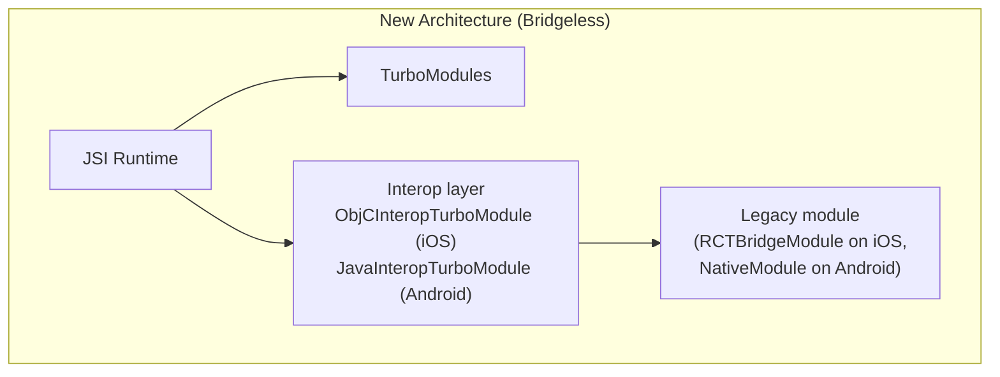

# Chapter 6: Bridgeless - The Ultimate Goal

The introduction of the JSI, Fabric, and TurboModules provides the foundational pieces to replace the legacy architecture. However, for a time, both the old and new systems could coexist in a single application to provide backward compatibility. The ultimate goal of the new architecture, however, was to completely remove the old one. This final state is known as **Bridgeless Mode**.

Bridgeless Mode was first made available as an opt-in with React Native 0.73 (December 2023), became the default for New Architecture-enabled apps in React Native 0.74 (April 22, 2024) [^1], and has been on for every new project since React Native 0.76 (October 2024), when the New Architecture itself became default-on [^2]. At HEAD on the v0.86 line, the legacy non-bridgeless path on iOS is hardcoded off: `RCTRootViewFactoryConfiguration` always sets `_bridgelessEnabled = YES`, and the entire `RCTArchConfiguratorProtocol` (which exposed the `bridgelessEnabled`/`newArchEnabled`/`turboModuleEnabled`/`fabricEnabled` toggles) is deprecated "and will be removed when we remove the legacy architecture" [^3].

## What is Bridgeless Mode?

Bridgeless mode is not a new component or a separate piece of technology. It is the architectural state where the original, asynchronous message-based Bridge is **no longer initialized or used**. In this mode, communication between JavaScript and the native platform flows through the JavaScript Interface (JSI), not through the legacy JSON message queue.

Concretely, instead of an `RCTBridge` / `CatalystInstance` pair, the runtime is owned by a `ReactInstance` (C++) sitting under a platform `ReactHost` (`RCTHost` on iOS, `ReactHost` on Android) [^4]. On Android, `BridgelessReactContext` replaces `ReactApplicationContext`; its source comment is blunt about this: "This class is used instead of ReactApplicationContext when React Native is operating in bridgeless mode. The purpose of this class is to override some methods on ReactContext that use the CatalystInstance, which doesn't exist in bridgeless mode." [^5] On iOS, anywhere old code asks for the `[RCTBridge currentBridge]`, RN substitutes an `RCTBridgeProxy` (an `NSProxy` that forwards `RCTBridgeModule` selectors to the bridgeless module registry) so that legacy modules keep working without a real bridge underneath [^6].

In an earlier intermediate state (the New Architecture enabled but `bridgelessEnabled = NO`, which was possible in 0.73 and early 0.74 betas), the Bridge could still be initialized alongside Fabric and TurboModules to support unmigrated native modules. In Bridgeless mode that path is gone: no JSON message queue, no `MessageQueue.js` global serializer, no batched bridge.

## Visual: bridgeless module routing

A modern TurboModule is reached through a CodeGen'd C++ binding installed on the JSI runtime. A legacy module is reached through one of two interop classes: `ObjCInteropTurboModule` on iOS [^7] or `JavaInteropTurboModule` on Android [^8]. Both subclass the platform's regular TurboModule base, expose the module's `RCT_EXPORT_METHOD` / `@ReactMethod` selectors as JSI properties via runtime introspection, and use a per-module method queue rather than the old global bridge queue.

## The Benefits of a Bridgeless World

Running without the Bridge unlocks the full potential of the New Architecture, leading to several key benefits:

1.  **Improved Performance:** This is the most significant advantage. By removing the need to initialize the Bridge and its modules at startup, apps launch faster. By eliminating the JSON serialization and the single batched message queue, communication latency is reduced. In code: `BridgelessNativeMethodCallInvoker` posts a raw `std::function<void()>` to a `MessageQueueThread` instead of marshalling `folly::dynamic` -> JSON -> bridge queue [^9].

2.  **Simplified Architecture and Threading:** Without the Bridge, the mental model for developers becomes simpler. There is no longer a JSON-serialized asynchronous boundary to reason about. The threading model is still multi-threaded (JS thread, UI thread, background module queues), but coordination is done through the `RuntimeScheduler` and the `CallInvoker` abstraction, not through a global batched-bridge dispatcher [^10].

3.  **Unlocking Modern React Features:** Concurrent rendering and Suspense need synchronous reads from the renderer (for example, `measure`, `measureInWindow`, and the layout effect commit path). The legacy Bridge could not serve those without blocking the JS thread on a round-trip. With Fabric on a JSI-driven runtime, the renderer makes those reads inline through C++ shared state, which is what React 18's `concurrentRoot: true` requires on the `render()` call [^11].

A note on "synchronous." JSI itself is synchronous: `jsi::Runtime::call`, `jsi::Object::getProperty`, and friends are direct C++ calls that run on whatever thread invokes them [^12]. But a TurboModule method can still be async by design (returning a `Promise`, or annotated `async` on Android). In that case the call still leaves the JS thread via `NativeMethodCallInvoker::invokeAsync`, which posts to a `MessageQueueThread`. So "Bridgeless is fully synchronous" is too strong. The accurate framing is: JSON serialization and the single global message queue are gone, and every call now enters native code through a JSI binding, but cross-thread dispatch is still real and still scheduled.

## The Interoperability Layer

The React Native team understood that a hard cutover to the new architecture was not feasible for the vast ecosystem of existing apps and third-party libraries. To facilitate a gradual migration, an interoperability layer was created.

This layer allows legacy, Bridge-based native modules to continue functioning in a Bridgeless world. When JavaScript calls a method on a legacy module, the call enters native code through a JSI TurboModule binding, but the TurboModule on the other side is one of the interop wrappers (`ObjCInteropTurboModule` on iOS, `JavaInteropTurboModule` on Android). The wrapper discovers the legacy module's exported methods via runtime introspection of its `RCT_EXPORT_METHOD` / `@ReactMethod` declarations, converts arguments via `RCTConvert` (or its Java equivalent), and invokes the legacy method through `NSInvocation` / `jmethodID`. The legacy module's own `dispatch_queue_t methodQueue` (iOS) is wrapped in a `LegacyModuleNativeMethodCallInvoker` so the call still lands on the queue the module expected [^13].

While this allows for backward compatibility, it does not provide the performance benefits of true TurboModules. The interop path pays runtime introspection cost on first use, ObjC dynamic dispatch / JNI call overhead per invocation, and `RCTConvert`-style argument coercion that CodeGen'd modules skip. The long-term goal is for the entire ecosystem to migrate to first-class TurboModule and Fabric APIs to reap the full benefits of the New Architecture.

In conclusion, Bridgeless mode represents the fulfillment of the New Architecture's promise: a faster, more efficient, and more capable React Native. It marks a definitive shift away from the original design and sets a new foundation for the future of the framework.

---

[^1]: "React Native 0.74 - Yoga 3.0, Bridgeless New Architecture, and more." React Native Blog, April 22, 2024. <https://reactnative.dev/blog/2024/04/22/release-0.74>. The 0.74 changelog lists "Make bridgeless the default when the New Arch is enabled" twice in `## 0.74.0` (once Android, once iOS) at `CHANGELOG-0.7x.md:2076` (commit `fe337f25be`) and `CHANGELOG-0.7x.md:2114` (commit `c91af773fa`).

[^2]: "React Native 0.76 - New Architecture by default." React Native Blog, October 23, 2024. <https://reactnative.dev/blog/2024/10/23/release-0.76-new-architecture>.

[^3]: `packages/react-native/Libraries/AppDelegate/RCTRootViewFactory.mm:62-79` (all init paths hardcode `_fabricEnabled = YES; _turboModuleEnabled = YES; _bridgelessEnabled = YES;`). `packages/react-native/Libraries/AppDelegate/RCTArchConfiguratorProtocol.h:13-14` ("RCTArchConfiguratorProtocol is deprecated and will be removed when we remove the legacy architecture.") and lines 20, 25, 30, 35 (`__attribute__((deprecated))` on every toggle).

[^4]: iOS: `packages/react-native/ReactCommon/react/runtime/platform/ios/ReactCommon/RCTHost.h:75-83` (designated initializer takes a `RCTHostJSEngineProvider`, no `RCTBridge` anywhere). C++ runtime: `packages/react-native/ReactCommon/react/runtime/ReactInstance.h:23` (`class ReactInstance final : private jsinspector_modern::InstanceTargetDelegate`). Android: `packages/react-native/ReactAndroid/src/main/java/com/facebook/react/ReactHost.kt:23-28` ("A ReactHost is an object that manages a single `com.facebook.react.runtime.ReactInstance`. A ReactHost can be constructed without initializing the ReactInstance, and it will continue to exist after the instance is destroyed.").

[^5]: `packages/react-native/ReactAndroid/src/main/java/com/facebook/react/runtime/BridgelessReactContext.kt:41-44`. The companion `BridgelessCatalystInstance` (same package) is annotated `@LegacyArchitecture(logLevel = LegacyArchitectureLogLevel.ERROR)` because every method on it throws `UnsupportedOperationException`. It exists only to keep old code that types against `CatalystInstance` compilable; using it at runtime is an error.

[^6]: `packages/react-native/React/Base/RCTBridgeProxy.h:19` (`@interface RCTBridgeProxy : NSProxy`). `packages/react-native/ReactCommon/react/runtime/platform/ios/ReactCommon/RCTInstance.mm:332-352` instantiates the proxy in the bridgeless setup path and sets it via `[RCTBridge setCurrentBridge:(RCTBridge *)bridgeProxy]` so legacy modules calling `self.bridge` keep working.

[^7]: `packages/react-native/ReactCommon/react/nativemodule/core/platform/ios/ReactCommon/RCTInteropTurboModule.h:20` (`class JSI_EXPORT ObjCInteropTurboModule : public ObjCTurboModule`). Method introspection: `RCTInteropTurboModule.mm:49-73` (`getMethodInfos` walks the class hierarchy looking for `__rct_export__`-prefixed selectors emitted by the `RCT_EXPORT_METHOD` macro).

[^8]: `packages/react-native/ReactCommon/react/nativemodule/core/platform/android/ReactCommon/JavaInteropTurboModule.h:21` (`class JSI_EXPORT JavaInteropTurboModule : public JavaTurboModule`).

[^9]: `packages/react-native/ReactCommon/react/runtime/BridgelessNativeMethodCallInvoker.cpp:16-26`. `invokeAsync` calls `messageQueueThread_->runOnQueue(std::move(func))`; `invokeSync` calls `runOnQueueSync`. No JSON, no `folly::dynamic` marshalling, no batched message buffer.

[^10]: `packages/react-native/ReactCommon/react/runtime/platform/ios/ReactCommon/RCTInstance.mm:331` (`auto jsCallInvoker = make_shared<RuntimeSchedulerCallInvoker>(_reactInstance->getRuntimeScheduler());`). The same `jsCallInvoker` is then passed to `RCTTurboModuleManager`, so TurboModules schedule JS work through the `RuntimeScheduler` rather than the bridge.

[^11]: `packages/react-native/Libraries/Renderer/shims/ReactNativeTypes.js:158-164` defines `render(element, containerTag, callback, concurrentRoot, options)` on the Fabric host config. Setting `concurrentRoot: true` is what enables React 18's concurrent features on a React Native root.

[^12]: `packages/react-native/ReactCommon/jsi/jsi/jsi.h:705-758` declares `class JSI_EXPORT Runtime : public IRuntime` with synchronous `Value getProperty(...)`, `bool hasProperty(...)`, `void setPropertyValue(...)`, etc. JSI calls execute inline on the caller's thread; they do not queue work.

[^13]: `packages/react-native/ReactCommon/react/nativemodule/core/platform/ios/ReactCommon/RCTTurboModuleManager.mm:136-157` defines `class LegacyModuleNativeMethodCallInvoker : public ModuleNativeMethodCallInvoker`. Lines 451-466 build it from the legacy module's `dispatch_queue_t methodQueue` and wrap the module in `ObjCInteropTurboModule`. The legacy method is invoked via `NSInvocation` against the original `RCT_EXPORT_METHOD` selectors.
