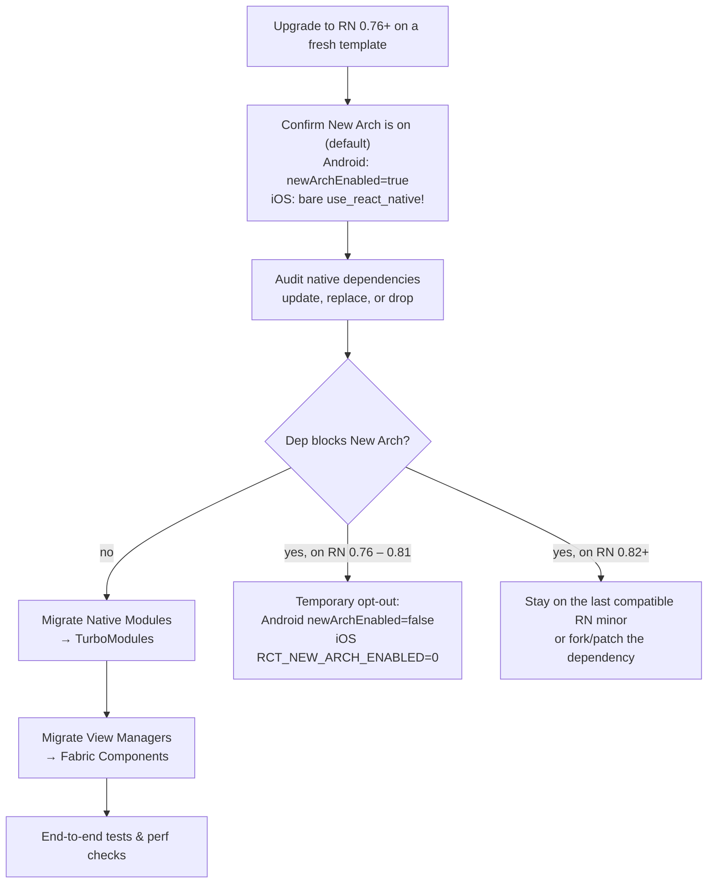

# Chapter 7: Migration and Adoption

Understanding the new architecture is the first step; the next is adopting it. For developers with existing React Native applications, this involves a clear migration path. For new applications, the New Architecture is enabled by default as of React Native 0.76,[^6] so the process involves learning the new, modern APIs.

**Important Note:** Opt-out of the New Architecture was removed in React Native 0.82.[^7] On Android, setting `newArchEnabled=false` in `gradle.properties` is force-overridden to `true` by the React Gradle plugin and logs an error.[^8] On iOS, setting `RCT_NEW_ARCH_ENABLED=0` in your Podfile or shell prints a warning ("is not supported anymore since React Native 0.82") and then gets overwritten to `"1"` inside `use_react_native!` itself.[^9] If you must keep the legacy bridge for a project, pin to the last 0.81.x release and plan a real migration before upgrading further.

The legacy bridge classes are still present in the tree but carry `[[deprecated("This API will be removed along with the legacy architecture.")]]` markers (159 such marks across `ReactCommon/cxxreact/`, `ReactCommon/jsiexecutor/`, `Libraries/Wrapper/`, and `Libraries/AppDelegate/` at the time of this audit), and the iOS build now defaults to excluding them via the `RCT_REMOVE_LEGACY_ARCH=1` compiler flag.[^5][^10] Plan for them to disappear entirely in a future minor.

This chapter is a practical guide to enabling the New Architecture and migrating legacy native modules and components. For the canonical, always-current guide, refer to the official React Native documentation.[^1]

## Visual: Migration Flow



## Step 1: Prerequisites and Enabling the New Architecture

Upgrade to React Native 0.76 or newer before migrating. Starting with that release stream, the New Architecture ships enabled by default, so the template projects already opt you in.[^4]

**For Android:**

Keep the `android/gradle.properties` flag in sync with the template:

```properties
newArchEnabled=true
```

On RN 0.76 through 0.81, flipping the flag to `false` is a valid temporary escape hatch while waiting on a dependency update. From RN 0.82 onward, the React Gradle plugin rejects that value. The relevant code lives in `ReactRootProjectPlugin.checkLegacyArchProperty` and the subproject loop above it: any `false` value is logged as an error ("Setting `newArchEnabled=false` in your `gradle.properties` file is not supported anymore since React Native 0.82") and the extra properties are force-set back to `"true"` for every subproject.[^8]

**For iOS:**

The CocoaPods helper enables the New Architecture automatically. Call `use_react_native!` exactly as in the current template (no additional flags required):

```ruby
use_react_native!(
  :path => config[:reactNativePath],
  :app_path => "#{Pod::Config.instance.installation_root}/.."
)
```

> **Deprecated guidance:** Older instructions recommended adding `:new_arch_enabled => true`. That parameter is still accepted (and documented as `[DEPRECATED]`) but is functionally ignored: `NewArchitectureHelper.new_arch_enabled` is hardcoded to `true` in the cocoapods helper, and `use_react_native!` unconditionally sets `ENV["RCT_NEW_ARCH_ENABLED"] = "1"` partway through its body. Leaving the call unmodified keeps you on the supported path.[^7]

On RN 0.76 through 0.81 you could temporarily opt out by setting `ENV['RCT_NEW_ARCH_ENABLED'] = '0'` before invoking the helper, or by passing the same env var on the shell:

```ruby
ENV['RCT_NEW_ARCH_ENABLED'] = '0'
use_react_native!(
  :path => config[:reactNativePath],
  :app_path => "#{Pod::Config.instance.installation_root}/.."
)
```

On RN 0.82+, both forms (Podfile-side `ENV` write and `RCT_NEW_ARCH_ENABLED=0 bundle exec pod install`) print the yellow warning `"is not supported anymore since React Native 0.82"` from `warn_if_new_arch_disabled`, then the helper overrides the env var to `"1"` later in the same function.[^9] In other words, the legacy iOS pod still installs against the New Architecture; the env var is no longer a real escape hatch.

### iOS AppDelegate: `RCTAppDelegate` is deprecated

`RCTAppDelegate` still exists but is marked deprecated at the class level: "RCTAppDelegate is deprecated and will be removed in a future version of React Native. Use `RCTReactNativeFactory` instead."[^11] The current template wires `RCTReactNativeFactory` directly from an `@main` Swift `AppDelegate`:

```swift
import React_RCTAppDelegate
import ReactAppDependencyProvider

@main
class AppDelegate: UIResponder, UIApplicationDelegate {
  var reactNativeFactory: RCTReactNativeFactory?

  func application(_ application: UIApplication,
                   didFinishLaunchingWithOptions launchOptions:
                     [UIApplication.LaunchOptionsKey: Any]? = nil) -> Bool {
    let delegate = ReactNativeDelegate()
    delegate.dependencyProvider = RCTAppDependencyProvider()
    let factory = RCTReactNativeFactory(delegate: delegate)
    reactNativeFactory = factory

    window = UIWindow(frame: UIScreen.main.bounds)
    factory.startReactNative(withModuleName: "HelloWorld",
                              in: window,
                              launchOptions: launchOptions)
    return true
  }
}

class ReactNativeDelegate: RCTDefaultReactNativeFactoryDelegate {
  override func bundleURL() -> URL? { /* … */ }
}
```

If you are migrating an older app that subclasses `RCTAppDelegate`, that path still works (the deprecation is a warning, not an error), but plan to swap to `RCTReactNativeFactory` before the next major. The bridge-backed `createBridgeWithDelegate:` and `createRootViewWithBridge:` callbacks on both `RCTAppDelegate` and `RCTReactNativeFactoryDelegate` are themselves marked "will be removed when removing the legacy architecture."[^11]

## Step 2: Migrating a Legacy Native Module to a TurboModule

The migration process for a native module centers on creating a formal spec and updating the native class to conform to the generated interface. The official documentation provides a detailed guide for this process.[^2]

**1. Create the JavaScript Spec**

First, define the module's interface in a TypeScript file (e.g., `NativeMyModule.ts`). This file is the new source of truth.

```typescript
import { TurboModule, TurboModuleRegistry } from 'react-native';

export interface Spec extends TurboModule {
  getValue(options: { a: string }): Promise<string>;
  getSyncValue(): string;
}

export default TurboModuleRegistry.getEnforcing<Spec>('MyModule');
```

Import `TurboModule` and `TurboModuleRegistry` from the public `'react-native'` entry, not from the deep `Libraries/TurboModule/...` paths. The deep `TurboModuleRegistry.js` file exports `get` and `getEnforcing` as named functions, not a `TurboModuleRegistry` namespace, so `import { TurboModuleRegistry } from 'react-native/Libraries/TurboModule/TurboModuleRegistry'` does not typecheck. The `react-native` package re-exports the file as a namespace via `export * as TurboModuleRegistry` in `packages/react-native/types/index.d.ts:143`, which is the form RN's own type test at `packages/react-native/types/__typetests__/turbo-module-sample.ts:8` uses.[^12]

The `TurboModule` base interface is just `{ getConstants?(): {} }` (see `Libraries/TurboModule/RCTExport.d.ts:10-12`), so the codegen pipeline treats any spec extending it as a candidate for native-side stub generation. `TurboModuleRegistry.getEnforcing<Spec>(name)` returns `Spec` (not `Spec | null`) and throws if the native module is missing; use `get<Spec>(name)` if a null return is preferable to a hard failure.[^12]

**2. Configure CodeGen**

In your library's `package.json`, add a `codegenConfig` section so the build system can find your spec. A real-world example (from `@react-native/popup-menu-android`) looks like:

```json
"codegenConfig": {
  "name": "ReactPopupMenuAndroidSpecs",
  "type": "components",
  "jsSrcsDir": "js",
  "outputDir": {
    "android": "android"
  },
  "includesGeneratedCode": true,
  "android": {
    "javaPackageName": "com.facebook.react.viewmanagers"
  }
}
```

For a TurboModule library use `"type": "modules"` (or `"all"` to mix modules and components in the same package). `jsSrcsDir` points at the directory CodeGen scans for `Native*.ts`/`*NativeComponent.ts` specs; `outputDir.android` and `outputDir.ios` tell CodeGen where to drop the generated native sources.[^13]

**3. Update the Native Implementation**

The native classes must now implement the interface that CodeGen generates from the spec, removing the old `RCT_EXPORT_METHOD` macros (and, on Android, the `@ReactMethod` annotations on the Java side). Method signatures must match the generated header exactly; CodeGen will fail the build if they drift.

## Step 3: Migrating a Legacy View Manager to a Fabric Component

Migrating a UI component follows a similar pattern: define a spec, configure CodeGen, and update the native implementation. The official documentation also provides a specific guide for Fabric components.[^3]

**1. Create the JavaScript Spec**

Define the component's props in a TypeScript file.

```typescript
import type { ViewProps } from 'react-native';
import codegenNativeComponent from 'react-native/Libraries/Utilities/codegenNativeComponent';

export interface MyComponentProps extends ViewProps {
  color: string;
}

export default codegenNativeComponent<MyComponentProps>('MyComponent');
```

The signature is `codegenNativeComponent<Props extends object>(componentName: string, options?: Options): HostComponent<Props>`, declared in `Libraries/Utilities/codegenNativeComponent.d.ts`. The options bag accepts `interfaceOnly`, `paperComponentName`, `paperComponentNameDeprecated`, `excludedPlatforms`, and `generateOptionalProperties` / `generateOptionalObjectProperties` flags.[^14]

**2. Update the Native Implementation**

The native view class on iOS should now inherit from `RCTViewComponentView`,[^15] and on Android from `BaseViewManagerInterface`'s generated delegate. Instead of `RCT_EXPORT_VIEW_PROPERTY` on iOS, override `updateProps:oldProps:`, which receives **two** `Props::Shared` (a shared pointer to `const Props`) values so you can diff the new props against the previous ones and only touch the UIKit surface for what actually changed. The canonical pattern from `RCTSwitchComponentView.mm` is:

```objc
- (void)updateProps:(const Props::Shared &)props oldProps:(const Props::Shared &)oldProps
{
  const auto &oldSwitchProps = static_cast<const SwitchProps &>(*_props);
  const auto &newSwitchProps = static_cast<const SwitchProps &>(*props);

  if (oldSwitchProps.value != newSwitchProps.value) {
    [_switchView setOn:newSwitchProps.value animated:_isInitialValueSet];
  }
  // …diff and apply any other props…

  [super updateProps:props oldProps:oldProps];  // NS_REQUIRES_SUPER
}
```

The `[super updateProps:]` call is enforced by `NS_REQUIRES_SUPER` on `RCTViewComponentView.h:70-71`; skipping it leaves the cached `_props` field stale and breaks `prepareForRecycle` for view-pool reuse.[^15]

## Step 4: Audit Dependencies

A critical part of the migration is to check third-party libraries that use native code. Most popular libraries have been updated to support the New Architecture, but older or less-maintained ones may not be compatible. Check each library's documentation (and the React Native Directory[^16] listing) and pin to versions that are explicitly New Architecture-ready. Note that this audit is now a hard gate: on RN 0.82+ you cannot ship the legacy bridge to escape a broken dependency. If an unmaintained library still uses bridge-only macros (`RCT_EXPORT_METHOD` without a corresponding codegen spec, `RCTViewManager` subclasses without a Fabric counterpart), the realistic options are to fork it, replace it, or stay on RN 0.81.x until upstream catches up.

---

**Citations:**

[^1]: "About the New Architecture". React Native Documentation. [https://reactnative.dev/architecture/landing-page](https://reactnative.dev/architecture/landing-page). (The earlier `docs/new-architecture-intro` page was folded into this canonical landing; the old slug now redirects off-site to the [reactwg migration guides](https://github.com/reactwg/react-native-new-architecture#guides).)
[^2]: "Turbo Native Modules". React Native Documentation. [https://reactnative.dev/docs/turbo-native-modules-introduction](https://reactnative.dev/docs/turbo-native-modules-introduction). (The earlier `docs/the-new-architecture/pillars-turbomodules` URL now redirects off-site; this is the current canonical page.)
[^3]: "Fabric Native Components". React Native Documentation. [https://reactnative.dev/docs/fabric-native-components-introduction](https://reactnative.dev/docs/fabric-native-components-introduction). (The earlier `docs/the-new-architecture/pillars-fabric-components` URL now redirects off-site; this is the current canonical page.)
[^4]: "About the New Architecture". React Native Documentation. [https://reactnative.dev/architecture/landing-page](https://reactnative.dev/architecture/landing-page)
[^5]: React Native source: the literal string `"This API will be removed along with the legacy architecture."` appears as a `[[deprecated(...)]]` marker across the legacy bridge stack. Representative examples: `packages/react-native/ReactCommon/cxxreact/Instance.h:44`, `cxxreact/JSExecutor.h:56`, `cxxreact/NativeToJsBridge.h:41`, `cxxreact/ModuleRegistry.h:33`, `jsiexecutor/jsireact/JSIExecutor.h:71`, `hermes/executor/HermesExecutorFactory.h:16`, `Libraries/Wrapper/RCTWrapperView.h:13-19`. On the iOS app shell, related-but-distinct wording covers `RCTAppDelegate` ("Use `RCTReactNativeFactory` instead."), `RCTReactNativeFactory` bridge accessors, and `RCTArchConfiguratorProtocol`: `Libraries/AppDelegate/RCTAppDelegate.h:62-73`, `Libraries/AppDelegate/RCTReactNativeFactory.h:63-115`, `Libraries/AppDelegate/RCTArchConfiguratorProtocol.h:13-35`.
[^6]: RN 0.76.0 release notes (entry `## v0.76.0` in `CHANGELOG-0.7x.md`): "TurboModules will be looked up as TurboModules first, and fallback to legacy modules after." Default-on rollout discussion: [https://reactnative.dev/blog/2024/10/23/release-0.76-new-architecture](https://reactnative.dev/blog/2024/10/23/release-0.76-new-architecture).
[^7]: RN 0.82.0 changelog (`CHANGELOG.md`, section `## v0.82.0`): "Remove possibility to newArchEnabled=false in 0.82" (commit `d5d21d0614`); "Removed the opt-out from the New Architecture" (commit `83e6eaf693`); "Crash the app if they force the legacy architecture" (commit `dc132a4fd4`). Tag `v0.82.0` was cut on 2025-10-07 (`06c4c425d7a`).
[^8]: `packages/gradle-plugin/react-native-gradle-plugin/src/main/kotlin/com/facebook/react/ReactRootProjectPlugin.kt:21-86`: the plugin's `apply` body force-sets `NEW_ARCH_ENABLED` and `SCOPED_NEW_ARCH_ENABLED` to `"true"` for every subproject, and `checkLegacyArchProperty` logs the "not supported anymore since React Native 0.82" error if the project tried to disable it.
[^9]: `packages/react-native/scripts/react_native_pods.rb:474-490` (`warn_if_new_arch_disabled`), called at line 76 inside `use_react_native!`. Line 116 then unconditionally does `ENV["RCT_NEW_ARCH_ENABLED"] = "1"`. The reusable hardcoded source-of-truth is `packages/react-native/scripts/cocoapods/new_architecture.rb:162-164`: `def self.new_arch_enabled; return true; end`.
[^10]: `packages/react-native/scripts/react_native_pods.rb:94-96` (`ENV['RCT_REMOVE_LEGACY_ARCH'] = ENV['RCT_REMOVE_LEGACY_ARCH'] == '0' ? '0' : '1'`) and lines 557-560 wire `-DRCT_REMOVE_LEGACY_ARCH=1` into the Pods project's compiler flags.
[^11]: `packages/react-native/Libraries/AppDelegate/RCTAppDelegate.h:22-24, 62-73`; `packages/react-native/Libraries/AppDelegate/RCTReactNativeFactory.h:34-43, 61-115`. The template Swift `AppDelegate` is at `private/helloworld/ios/HelloWorld/AppDelegate.swift:13-50` (committed at HEAD `b32a6c9e9db`).
[^12]: `packages/react-native/Libraries/TurboModule/RCTExport.d.ts:10-12` defines the public `TurboModule` interface. `packages/react-native/Libraries/TurboModule/TurboModuleRegistry.d.ts:12-13` and `TurboModuleRegistry.js:35-47` define `get<T>(name)` (nullable) and `getEnforcing<T>(name)` (throws on miss). The internal `requireModule` falls back to the legacy `NativeModules` map when `global.__turboModuleProxy` is unavailable, which is the interop path mentioned in the 0.76 changelog.
[^13]: A real `codegenConfig` block lives at `packages/react-native-popup-menu-android/package.json:39-50`. CodeGen reads it via `packages/react-native/scripts/codegen/generate-artifacts-executor/generateRCTModuleProviders.js:49`. Allowed `type` values are `modules`, `components`, and `all`.
[^14]: `packages/react-native/Libraries/Utilities/codegenNativeComponent.d.ts:12-28` declares both the options shape and the function signature. The Flow implementation lives at `codegenNativeComponent.js:34-73`; at runtime in Bridgeless dev builds it logs a warning if it ever actually executes, because the call should normally be replaced by the codegen build step.
[^15]: `packages/react-native/React/Fabric/Mounting/ComponentViews/View/RCTViewComponentView.h:25-77`. Working diff-style example: `packages/react-native/React/Fabric/Mounting/ComponentViews/Switch/RCTSwitchComponentView.mm:70-104`.
[^16]: React Native Directory (community-maintained compatibility tracker). [https://reactnative.directory/](https://reactnative.directory/)
