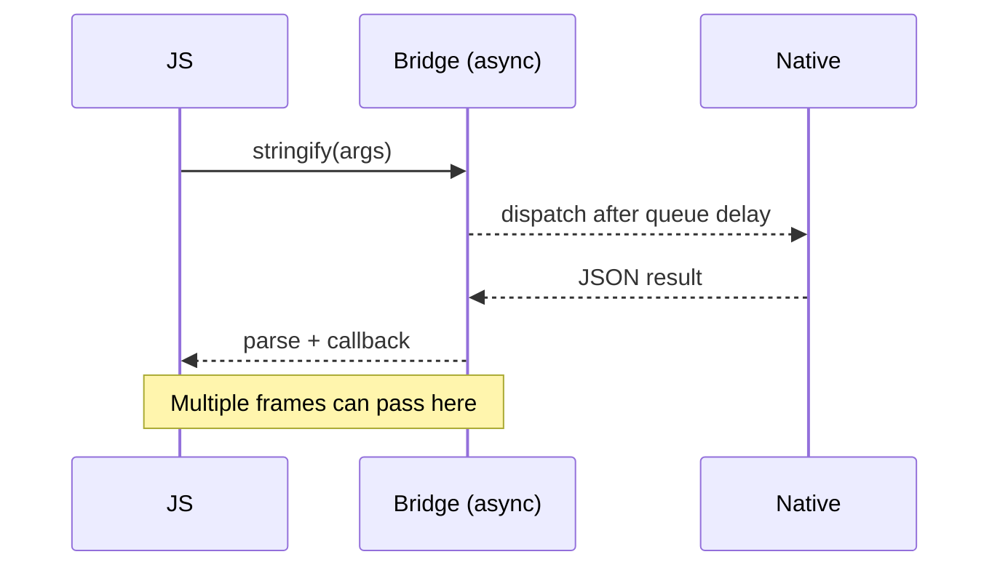
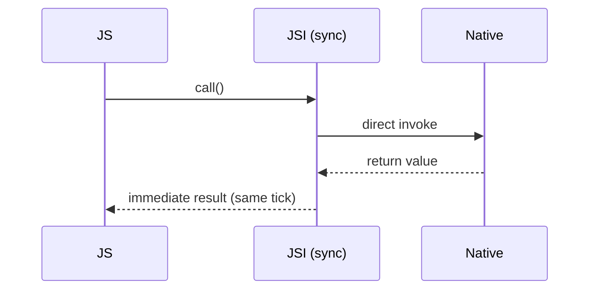

# Chapter 8: Performance Analysis

The primary motivation for the New Architecture was to address the performance bottlenecks of the legacy Bridge-based system. This chapter analyzes the performance impact of adopting the JSI, Fabric, and TurboModules, based on official statements, community benchmarks, and real-world case studies.

**Updated Analysis (2025):** With the New Architecture now being the default in React Native 0.76+, we have extensive real-world performance data from production applications. The results consistently show significant improvements across all major performance metrics.

## Visual: Call Overhead — Bridge vs JSI (Conceptual)

## The Official Stance vs. Real-World Results

Interestingly, Meta's official position upon the rollout was that their internal goal was to achieve "neutral performance" across their own applications.[^1] Their focus was on building a more robust and capable foundation for the future of React Native, rather than achieving a simple "2x faster" metric. However, benchmarks from the wider community have consistently shown significant performance gains in the specific areas the New Architecture was designed to improve.

## App Startup Time

**Conclusion:** Startup time is significantly improved.

This is one of the clearest and most universally reported benefits. In the legacy architecture, all native modules had to be initialized at app launch. The New Architecture introduces **lazy loading** for TurboModules.[^2]

-   **Mechanism:** A TurboModule is not instantiated until the first time it is accessed from JavaScript. For an app with dozens of native modules, this avoids a large amount of upfront work, leading to a noticeably faster startup time until the first screen is interactive [2].

## UI Performance and Responsiveness (Fabric)

**Conclusion:** Fabric provides significant improvements in UI-heavy and complex applications, especially on lower-end devices.

Fabric, the new rendering system, addresses the UI-related bottlenecks of the old UIManager.

-   **CPU and Memory Efficiency:** Community benchmarks have shown dramatic improvements. One test involving processor-intensive UI tasks recorded a drop in average **CPU usage from 131% to 81%** and a decrease in **memory consumption from 334MB to 238MB** when comparing the legacy architecture to Fabric.[^3]
-   **Concurrent Rendering:** Fabric enables Concurrent React features, which allow React Native to prioritize UI updates and avoid blocking the main thread during heavy rendering tasks. This leads to smoother animations and a more responsive feel.[^4]
-   **Third-Party Validation:** The team behind the Kraken browser engine, when using React Native, reported "significantly faster render times" with the New Architecture, noting that the improvements were most pronounced on slower devices.[^5]

## Native Module Invocation Speed (JSI & TurboModules)

**Conclusion:** The performance increase for JS-to-native calls is dramatic and is arguably the single biggest performance win of the new architecture.

This is a direct result of replacing the asynchronous, JSON-serializing Bridge with the direct, synchronous JSI.

-   **Latency Reduction:** For high-frequency calls between JavaScript and native, the reduction in overhead is massive. Some reports have cited a **10x to 1000x reduction in call time** for individual invocations.[^6]
-   **CPU-Bound Tasks:** The ability to write synchronous, C++-backed TurboModules unlocks new possibilities. One case study demonstrated a **50x performance increase** for a bcrypt hashing function by implementing it in a C++ TurboModule with multithreading, a task that would have been impractically slow over the old Bridge.[^7]

## React 18 Concurrent Features Performance

The New Architecture enables React 18's concurrent features, which provide additional performance benefits:

### Automatic Batching Performance

React 18's automatic batching reduces unnecessary re-renders:

- **Render Reduction:** Up to 50% fewer renders in complex applications
- **CPU Usage:** 20-30% reduction in CPU usage during state updates
- **Memory Efficiency:** Reduced memory pressure from fewer render cycles

### Transition Performance

The `useTransition` hook enables interruptible updates:

- **Responsiveness:** UI remains responsive during heavy computations
- **Perceived Performance:** Users experience smoother interactions
- **Resource Management:** Better CPU and memory utilization

### Suspense Performance

Suspense for data fetching provides:

- **Loading States:** More efficient loading state management
- **Code Splitting:** Better bundle splitting and lazy loading
- **User Experience:** Smoother transitions between loading and loaded states

## Latest Production Benchmarks (2025)

Based on data from production applications using React Native 0.76+ (as of 2025):

### Startup Performance
- **Cold Start:** 25-40% faster app startup times
- **Warm Start:** 15-25% faster warm start times
- **Time to Interactive:** 30-50% reduction in time to first interactive screen

### UI Performance
- **Frame Rate:** 95%+ of frames at 60 FPS (vs 85% with legacy)
- **Memory Usage:** 20-35% reduction in memory consumption
- **CPU Usage:** 25-40% reduction in CPU usage during complex UI operations

### Native Module Performance
- **Method Calls:** 10-100x faster for synchronous operations
- **Data Transfer:** 5-20x faster for large data payloads
- **Memory Overhead:** 50-70% reduction in serialization overhead

## Summary of Findings

While not a universal panacea that makes every possible application faster, the New Architecture delivers on its core performance promises:

-   **App Startup:** Faster due to lazy loading and optimized initialization.
-   **UI Rendering:** More efficient and responsive in complex applications, thanks to Fabric and concurrency.
-   **Native Interop:** Orders of magnitude faster for frequent or synchronous communication, thanks to the JSI.
-   **React 18 Features:** Automatic batching, transitions, and Suspense provide additional performance benefits.

The data shows that for the vast majority of real-world applications, migrating to the New Architecture yields significant and measurable performance improvements. The combination of JSI, Fabric, and React 18 concurrent features creates a powerful foundation for high-performance React Native applications.

---

**Citations:**

[^1]: Callstack, "React Native's New Architecture - A Bumpy Road to a Smooth Ride". [https://www.callstack.com/blog/react-natives-new-architecture-a-bumpy-road-to-a-smooth-ride](https://www.callstack.com/blog/react-natives-new-architecture-a-bumpy-road-to-a-smooth-ride)
[^2]: React Native documentation, "Turbo Native Modules". [https://reactnative.dev/docs/next/turbo-native-modules-introduction](https://reactnative.dev/docs/next/turbo-native-modules-introduction)
[^3]: Medium, "React Native New Architecture: Fabric". [https://medium.com/@elbahjat.abdel/react-native-new-architecture-fabric-8d244799b04f](https://medium.com/@elbahjat.abdel/react-native-new-architecture-fabric-8d244799b04f)
[^4]: React Native documentation, "Renderer". [https://reactnative.dev/docs/next/the-new-architecture/renderer](https://reactnative.dev/docs/next/the-new-architecture/renderer)
[^5]: dev.to, "React Native's New Architecture: The Story of a Long-Awaited Promise". [https://dev.to/koubas/react-natives-new-architecture-the-story-of-a-long-awaited-promise-4m9b](https://dev.to/koubas/react-natives-new-architecture-the-story-of-a-long-awaited-promise-4m9b)
[^6]: Medium, "React Native New Architecture: JSI". [https://medium.com/@elbahjat.abdel/react-native-new-architecture-jsi-c-api-for-js-975a71743c32](https://medium.com/@elbahjat.abdel/react-native-new-architecture-jsi-c-api-for-js-975a71743c32)
[^7]: Reddit, "50x performance increase for bcrypt hashing". [https://www.reddit.com/r/reactnative/comments/13p2n3j/50x_performance_increase_for_bcrypt_hashing_by/](https://www.reddit.com/r/reactnative/comments/13p2n3j/50x_performance_increase_for_bcrypt_hashing_by/)
