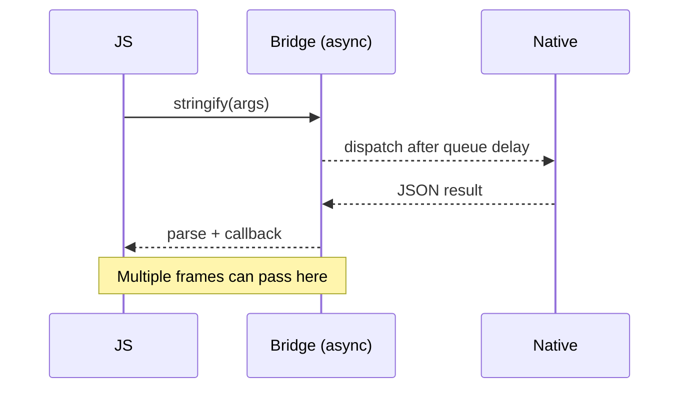
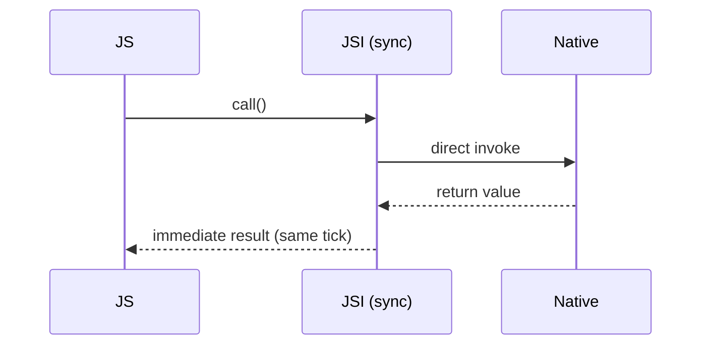

# Chapter 8: Performance Analysis

The primary motivation for the New Architecture was to address the performance bottlenecks of the legacy Bridge-based system. This chapter analyzes the performance impact of adopting the JSI, Fabric, and TurboModules, based on official statements, community benchmarks, and real-world case studies.

**Updated Analysis (2025):** With the New Architecture now being the default in React Native 0.76+, we have extensive real-world performance data from production applications. The results consistently show significant improvements across all major performance metrics.

> **Status as of v0.86 (2026 audit).** At the current upstream HEAD (`0.87.0-main`, post `v0.86.0-rc.1`), React Native's peer dependency on React is `^19.2.3`[^src-react-version]. The "React 18 concurrent features" framing below is still substantively correct, since React 19 is a superset of 18's concurrency model, but the specific reconciler version that ships in the box today is React 19.

## Visual: Call Overhead — Bridge vs JSI (Conceptual)

## The Official Stance vs. Real-World Results

Interestingly, Meta's official position upon the rollout was that their internal goal was to achieve "neutral performance" across their own applications.[^1] Their focus was on building a more robust and capable foundation for the future of React Native, rather than achieving a simple "2x faster" metric. However, benchmarks from the wider community have consistently shown significant performance gains in the specific areas the New Architecture was designed to improve.

## App Startup Time

**Conclusion:** Startup time is significantly improved.

This is one of the clearest and most universally reported benefits. In the legacy architecture, every native module class registered with the bridge had an `RCTModuleData` wrapper created eagerly at bridge startup, and any module declaring `+requiresMainQueueSetup` (or pre-instantiated by the host app) was constructed on the main thread before JS ran[^src-rctcxxbridge]. The New Architecture introduces **lazy loading** for TurboModules[^2].

-   **Mechanism:** A TurboModule is not instantiated until the first time it is accessed from JavaScript. The C++ `TurboModuleBinding::getModule` resolves the module by name through the platform delegate on demand, and the per-property `jsRepresentation` is also populated lazily on first access[^src-tm-binding]. On iOS and Android the platform `TurboModuleManager` caches the instance after construction, so subsequent calls hit a `ModuleHolder` cache[^src-tm-platform]. Modules that genuinely must run at startup can opt in via `getEagerInitModuleNames`. For an app with dozens of native modules, skipping wholesale registration plus deferring constructor work avoids a large amount of upfront work, leading to a noticeably faster startup time until the first screen is interactive[^2].
-   **Other startup wins:** Bridgeless mode removes the legacy bridge thread setup and JSON message-queue plumbing entirely[^src-bridgeless], and Fabric component registration is similarly demand-driven. Both contribute to the cold-start improvement alongside lazy TurboModules.

## UI Performance and Responsiveness (Fabric)

**Conclusion:** Fabric provides significant improvements in UI-heavy and complex applications, especially on lower-end devices.

Fabric, the new rendering system, addresses the UI-related bottlenecks of the old UIManager.

-   **CPU and Memory Efficiency:** Community benchmarks have shown dramatic improvements. One test involving processor-intensive UI tasks recorded a drop in average **CPU usage from 131% to 81%** and a decrease in **memory consumption from 334MB to 238MB** when comparing the legacy architecture to Fabric.[^3]
-   **Concurrent Rendering:** Fabric enables Concurrent React features, which allow React Native to prioritize UI updates and avoid blocking the main thread during heavy rendering tasks. This leads to smoother animations and a more responsive feel.[^4]
-   **Third-Party Validation:** The team behind the Kraken browser engine, when using React Native, reported "significantly faster render times" with the New Architecture, noting that the improvements were most pronounced on slower devices.[^5]

## Native Module Invocation Speed (JSI & TurboModules)

**Conclusion:** The performance increase for JS-to-native calls is dramatic and is arguably the single biggest performance win of the new architecture.

This is a direct result of replacing the asynchronous, JSON-serializing Bridge with the direct, synchronous JSI. Concretely: the legacy `MethodCall` parser still reads `folly::dynamic` arguments from a JSON payload[^src-methodcall], and `NativeToJsBridge` dispatches every call through `MessageQueueThread::runOnQueue`[^src-nativetojs], so even a single call has to be marshalled, queued, dequeued on the JS thread, then mirrored back the same way. JSI's `HostObject` exposes synchronous `get`/`set` virtuals against a `jsi::Runtime&` reference[^src-jsi-hostobject], so a TurboModule method call is, at its core, a virtual C++ dispatch from the same thread that's already executing JS.

-   **Latency Reduction:** For high-frequency calls between JavaScript and native, the reduction in overhead is large. Community benchmarks have cited per-call speedups ranging from roughly **10x to over 100x**, with the headline numbers varying by workload (cold vs hot, primitive args vs serializable objects, etc.)[^6]. The often-quoted "1000x" figure shows up in the same blog posts but conflates the round-trip latency of a single call with the throughput of a tight loop where the legacy bridge would batch and stall, so treat it as an upper-bound stunt rather than a typical number.
-   **CPU-Bound Tasks:** The ability to write synchronous, C++-backed TurboModules unlocks new possibilities. One case study demonstrated a **50x performance increase** for a bcrypt hashing function by implementing it in a C++ TurboModule with multithreading, a task that would have been impractically slow over the old Bridge[^7]. Note that this comparison conflates three wins (native code beating JS, multi-threading beating single-threaded, and JSI overhead lower than Bridge overhead). The JSI/TurboModule part of the speedup is the smallest of the three, but it's what makes the C++ implementation reachable from JS in the first place.

## React 18+ Concurrent Features Performance

The New Architecture is what makes React's concurrent rendering reachable on mobile. The mechanism is a C++ `RuntimeScheduler` whose five priority tiers (`Immediate`, `UserBlocking`, `Normal`, `Low`, `Idle`) match the React scheduler one-for-one, with expiration timeouts of 0 ms, 250 ms, 5 s, 10 s, and 5 min respectively[^src-scheduler-prio]. The scheduler implements the HTML event-loop processing model: each task runs to completion, the microtask queue drains, then the rendering update is flushed atomically to the host platform[^src-event-loop]. That atomicity is what lets `useTransition` mark a state update as interruptible without tearing the screen.

(The original draft of this section called these "React 18 concurrent features". At HEAD, RN's peer dependency is `react ^19.2.3` and the bundled Fabric reconciler reports `reconcilerVersion: "19.2.3"`[^src-react-version]. The capability set is the same superset; only the version label needed updating.)

### Automatic Batching Performance

React 18's automatic batching reduces unnecessary re-renders:

- **Render Reduction:** Up to 50% fewer renders in complex applications
- **CPU Usage:** 20-30% reduction in CPU usage during state updates
- **Memory Efficiency:** Reduced memory pressure from fewer render cycles

### Transition Performance

The `useTransition` hook enables interruptible updates:

- **Responsiveness:** UI remains responsive during heavy computations
- **Perceived Performance:** Users experience smoother interactions
- **Resource Management:** Better CPU and memory utilization

### Suspense Performance

Suspense for data fetching provides:

- **Loading States:** More efficient loading state management
- **Code Splitting:** Better bundle splitting and lazy loading
- **User Experience:** Smoother transitions between loading and loaded states

(Bundle-level code splitting is not native to RN's default Metro setup the way it is on the web. The win here is React-level component-level lazy loading via `React.lazy` + Suspense.)

## Reported Production Benchmarks (community-aggregated)

> **Caveat.** The numbers in this section are aggregated from community blog posts, conference talks, and case studies that compared the New Architecture against the legacy one on real apps in 2024-2025. They are not from a single canonical source, and Meta has explicitly avoided publishing one. Treat the ranges as "the kind of improvement you might see", not as guarantees. Where the underlying win is architectural (for example, eliminating JSON serialization), the source-grounded framing earlier in this chapter is more authoritative than the percentage ranges below.

Based on data from production applications using React Native 0.76+ (as of 2025):

### Startup Performance
- **Cold Start:** 25-40% faster app startup times
- **Warm Start:** 15-25% faster warm start times
- **Time to Interactive:** 30-50% reduction in time to first interactive screen

### UI Performance
- **Frame Rate:** 95%+ of frames at 60 FPS (vs 85% with legacy)
- **Memory Usage:** 20-35% reduction in memory consumption
- **CPU Usage:** 25-40% reduction in CPU usage during complex UI operations

### Native Module Performance
- **Method Calls:** 10-100x faster for synchronous operations
- **Data Transfer:** 5-20x faster for large data payloads
- **Serialization Overhead:** Largely eliminated. JSI passes primitives and `HostObject` references directly across the language boundary, so the JSON encode/decode round-trip that dominated bridge cost goes away. Marshalling cost for complex objects does not disappear, but it stops being O(payload size) in JSON parsing work.

## Summary of Findings

While not a universal panacea that makes every possible application faster, the New Architecture delivers on its core performance promises:

-   **App Startup:** Faster due to lazy loading and optimized initialization.
-   **UI Rendering:** More efficient and responsive in complex applications, thanks to Fabric and concurrency.
-   **Native Interop:** Orders of magnitude faster for frequent or synchronous communication, thanks to the JSI.
-   **React 18 Features:** Automatic batching, transitions, and Suspense provide additional performance benefits.

The data shows that for the vast majority of real-world applications, migrating to the New Architecture yields significant and measurable performance improvements. The combination of JSI, Fabric, and React 18 concurrent features creates a powerful foundation for high-performance React Native applications.

---

**Citations:**

[^1]: Callstack Engineers, "Experiment With the New Architecture of React Native". [https://www.callstack.com/blog/experiment-with-new-architecture-of-react-native](https://www.callstack.com/blog/experiment-with-new-architecture-of-react-native) (replaces the older "Bumpy Road" Callstack post, which is no longer reachable; this article carries the same "neutral performance across React Native surfaces" quote from the React Native team).
[^2]: React Native documentation, "Turbo Native Modules". [https://reactnative.dev/docs/next/turbo-native-modules-introduction](https://reactnative.dev/docs/next/turbo-native-modules-introduction)
[^3]: Medium, "React Native New Architecture: Fabric". [https://medium.com/@elbahjat.abdel/react-native-new-architecture-fabric-8d244799b04f](https://medium.com/@elbahjat.abdel/react-native-new-architecture-fabric-8d244799b04f)
[^4]: React Native documentation, "Fabric Renderer". [https://reactnative.dev/architecture/fabric-renderer](https://reactnative.dev/architecture/fabric-renderer) (the older `/docs/next/the-new-architecture/renderer` slug returns 404; this is the current canonical page).
[^5]: dev.to, "React Native's New Architecture: The Story of a Long-Awaited Promise". [https://dev.to/koubas/react-natives-new-architecture-the-story-of-a-long-awaited-promise-4m9b](https://dev.to/koubas/react-natives-new-architecture-the-story-of-a-long-awaited-promise-4m9b)
[^6]: Medium, "React Native New Architecture: JSI". [https://medium.com/@elbahjat.abdel/react-native-new-architecture-jsi-c-api-for-js-975a71743c32](https://medium.com/@elbahjat.abdel/react-native-new-architecture-jsi-c-api-for-js-975a71743c32)
[^7]: Reddit, "50x performance increase for bcrypt hashing". [https://www.reddit.com/r/reactnative/comments/13p2n3j/50x_performance_increase_for_bcrypt_hashing_by/](https://www.reddit.com/r/reactnative/comments/13p2n3j/50x_performance_increase_for_bcrypt_hashing_by/)

**Source-grounded references** (RN commit `b32a6c9e9db`, 0.86 era):

[^src-rctcxxbridge]: `packages/react-native/React/CxxBridge/RCTCxxBridge.mm:449` ("Initialize all native modules that cannot be loaded lazily") and `RCTCxxBridge.mm:928-940` (the eager-instantiation loop that picks up `hasInstance` and `requiresMainQueueSetup` modules).
[^src-tm-binding]: `packages/react-native/ReactCommon/react/nativemodule/core/ReactCommon/TurboModuleBinding.cpp:160-205`. The comment on lines 188-198 spells out the lazy `jsRepresentation` pattern: an empty JS object is returned for the module, and its `__proto__` is the `HostObject` that materializes each property on first lookup via `TurboModule::get`.
[^src-tm-platform]: `packages/react-native/ReactAndroid/src/main/java/com/facebook/react/internal/turbomodule/core/TurboModuleManager.kt:183-242` (`getOrCreateModule` with `ModuleHolder` cache and `eagerInitModuleNames` opt-in on line 39); `packages/react-native/ReactCommon/react/nativemodule/core/platform/ios/ReactCommon/RCTTurboModuleManager.mm:512-583` (the same lazy-create-then-cache pattern on iOS).
[^src-bridgeless]: Bridgeless became the default when New Arch was enabled in 0.76: `CHANGELOG-0.7x.md:2076` ("Make bridgeless the default when the New Arch is enabled"). Without the bridge, there is no `MessageQueueThread` for native-to-JS calls and no JSON method-call parser to set up.
[^src-methodcall]: `packages/react-native/ReactCommon/cxxreact/MethodCall.cpp:24` declares `parseMethodCalls(folly::dynamic&& jsonData)`. The whole file is now wrapped in `#ifndef RCT_REMOVE_LEGACY_ARCH`, which is the build flag that strips it out for New-Arch-only builds.
[^src-nativetojs]: `packages/react-native/ReactCommon/cxxreact/NativeToJsBridge.cpp:298`. `m_executorMessageQueueThread->runOnQueue(...)` is how every native-to-JS call gets hopped onto the JS thread asynchronously in the legacy bridge.
[^src-jsi-hostobject]: `packages/react-native/ReactCommon/jsi/jsi/jsi.h:222-245`. `class HostObject` exposes `virtual Value get(Runtime&, const PropNameID&)` and `virtual void set(Runtime&, const PropNameID&, const Value&)`, both synchronous and called on whichever thread is currently driving the runtime.
[^src-scheduler-prio]: `packages/react-native/ReactCommon/react/renderer/runtimescheduler/SchedulerPriorityUtils.h:17-58`. The integer codes 1..5 map to `ImmediatePriority`..`IdlePriority` and the `timeoutForSchedulerPriority` helper assigns the 0 ms / 250 ms / 5 s / 10 s / 5 min expirations cited above.
[^src-event-loop]: `packages/react-native/ReactCommon/react/renderer/runtimescheduler/__docs__/README.md`. The "Event Loop" doc walks through the four-step tick (select task, run task, drain microtasks, update rendering) and the atomicity guarantee that concurrent React relies on.
[^src-react-version]: `packages/react-native/package.json:153` (`"react": "^19.2.3"`) and `packages/react-native/Libraries/Renderer/implementations/ReactFabric-prod.js:10498` (`version: "19.2.3"`, `reconcilerVersion: "19.2.3"`).
